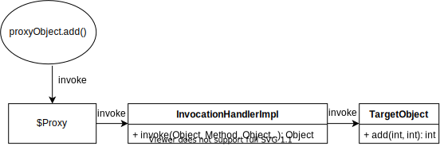
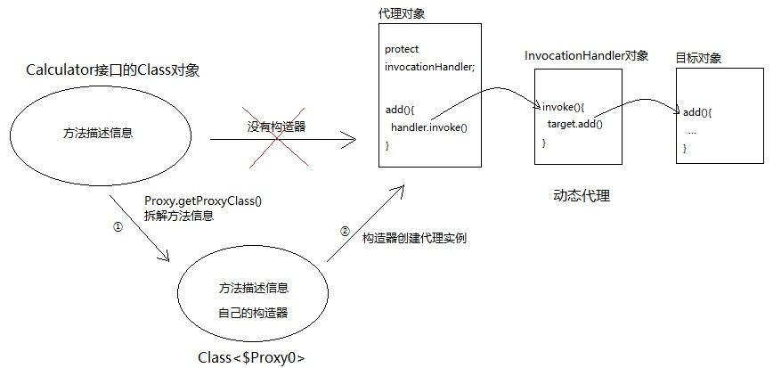

# 为什么动态代理对象proxy的System.out.println(proxy)与System.out.println(proxy.getClass)的输出结果不同

## 起因

在学习Spring的AOP面向切面编程时,有这么一个例子

Calculator接口

```java
public interface Calculator {
    int add(int a, int b);
    int sub(int a, int b);
    int mul(int a, int b);
    int div(int a, int b);
}
```

Calculator的实现类

```java
@Service
public class CalculatorImpl implements Calculator {
    public int add(int a, int b) {
        return a + b;
    }
    public int sub(int a, int b) {
        return a - b;
    }
    public int mul(int a, int b) {
        return a * b;
    }
    public int div(int a, int b) {
        return a / b;
    }
}
```

切面类

```java
@Aspect
@Component
public class LogUtils {
    private static Logger logger = LogManager.getLogger(LogUtils.class);

    @Before("execution(public int com.wuyue.CalculatorImpl.*(int,int))")
    public static void methodStart() {
        logger.info("方法被执行, 参数为");
    }

    @AfterReturning("execution(public int com.wuyue.CalculatorImpl.*(int,int))")
    public static void methodReturn() {
        logger.info("方法返回, 结果为");
    }

    @AfterThrowing("execution(public int com.wuyue.CalculatorImpl.*(int,int))")
    public static void methodException() {
        logger.warn("方法异常, 异常为");
    }

    @After("execution(public int com.wuyue.CalculatorImpl.*(int,int))")
    public static void methodEnd() {
        logger.info("方法结束");
    }
}
```

测试类

```java
@Test
public void testCal() {
    Calculator bean = ioc.getBean(Calculator.class);
    bean.add(1, 2);
    bean.div(3, 4);
    System.out.println(bean);
    System.out.println(bean.getClass());
}
```

其中CalculatorImpl是一个被切面的类,其接口是Calculator. LogUtils是切面类,切入了CalculatorImpl的所有方法,用于记录日志,@Test为测试类  
而在测试中可以发现`System.out.println(bean)`与`System.out.println(bean.getClass())`的输出并不相同.
其输出结果分别为:
`com.wuyue.CalculatorImpl@xxxxxxx`
`class com.sun.proxy.$Proxy`
可以发现它们二者的类型并不相同

```java
@Test
public void testObject() {
    class TestInnerClass {
    }
    TestInnerClass testClass = new TestInnerClass();
    System.out.println(testClass);
    System.out.println(testClass.getClass());
}
```

输出:

```text
com.wuyue.test.CalTest$1TestInnerClass@7fb9f71f
class com.wuyue.test.CalTest$1TestInnerClass
```

可以看出,对于一般对象而言,这两个输出的类型应该相同,为什么动态代理对象就不同了呢

我们知道用print方法打印一个对象时,会调用这个对象的toString方法,而被代理对象没有实现toString方法,呢么就会调用其父类Object的toString方法  
我们分别看一下Object类和Class类的toString方法

**Class**:

```java
public String toString() {
    return (isInterface() ? "interface " : (isPrimitive() ? "" : "class "))
        + getName();
}
```

**Object**:

```java
public String toString() {
    return getClass().getName() + "@" + Integer.toHexString(hashCode());
}
```

被代理类不是接口且不是Java原生类型,呢么bean.getClass().toString()应该返回`"class " + getName()`

```java
System.out.println(bean);
System.out.println(bean.getClass());
```

那么上方的打印语句可以等价为:

```java
System.out.println(bean.getClass().getName() + "@" + Integer.toHexString(hashCode()));
System.out.println("class " + bean.getClass().getName());
```

它们的输出类型应该相同才对啊!

其实这里的第一条打印语句的等价变换并不成立.所有的代理对象方法的调用最终都将调用目标对象的同名方法,也就是说`bean.toString()`最终调用的是目标对象的toString()方法,而目标对象的类型是CalculatorImpl.

## 动态代理的调用流程

我们创建一个简单的动态代理对象用于代理CalculatorImpl对象,看一下JDK动态代理对象是怎么运行的.

```java
public class CalcuProxy {
    public static Object getProxy(Object target) {
        return Proxy.newProxyInstance(target.getClass().getClassLoader(),
                target.getClass().getInterfaces(),
                (proxy, method, args) -> {
                    return method.invoke(target, args);
                });
    }
}
```


当调用代理对象的add方法时,代理对象调用了一个InvocationHandler的实现类的invoke()方法,这个实现类是我们自己实现的,然后这个类通过反射又调用了目标对象的add方法,所以动态代理方法的调用大致如下图所示



>Proxies are classes that are created and loaded at runtime. There is no source code for these classes.
由于动态代理对象是在运行时动态生成的,所以没有源码可以查看.

```java
public static void main(String[] args) {
    System.getProperties().put("jdk.proxy.ProxyGenerator.saveGeneratedFiles", "true");
    System.out.println(Proxy.getProxyClass(Calculator.class.getClassLoader(), Calculator.class));
    Calculator calculator = (Calculator) CalcuProxy.getProxy(new CalculatorImpl());
    System.out.println(calculator.add(1, 3));
}
```

通过设置System参数的方式,可以将代理对象的.class在运行的时候保存到项目根目录下,相对路径为com/sun/proxy/$Proxy0.class,反编译后如下所示

```java
//
// Source code recreated from a .class file by IntelliJ IDEA
// (powered by Fernflower decompiler)
//

package com.sun.proxy;

import com.wuyue.Calculator;
import java.lang.reflect.InvocationHandler;
import java.lang.reflect.Method;
import java.lang.reflect.Proxy;
import java.lang.reflect.UndeclaredThrowableException;

public final class $Proxy0 extends Proxy implements Calculator {
    private static Method m1;
    private static Method m2;
    private static Method m6;
    private static Method m3;
    private static Method m4;
    private static Method m5;
    private static Method m0;

    public $Proxy0(InvocationHandler var1) throws  {
        super(var1);
    }

    public final boolean equals(Object var1) throws  {
        try {
            return (Boolean)super.h.invoke(this, m1, new Object[]{var1});
        } catch (RuntimeException | Error var3) {
            throw var3;
        } catch (Throwable var4) {
            throw new UndeclaredThrowableException(var4);
        }
    }

    public final String toString() throws  {
        try {
            return (String)super.h.invoke(this, m2, (Object[])null);
        } catch (RuntimeException | Error var2) {
            throw var2;
        } catch (Throwable var3) {
            throw new UndeclaredThrowableException(var3);
        }
    }

    public final int mul(int var1, int var2) throws  {
        try {
            return (Integer)super.h.invoke(this, m6, new Object[]{var1, var2});
        } catch (RuntimeException | Error var4) {
            throw var4;
        } catch (Throwable var5) {
            throw new UndeclaredThrowableException(var5);
        }
    }

    public final int add(int var1, int var2) throws  {
        try {
            return (Integer)super.h.invoke(this, m3, new Object[]{var1, var2});
        } catch (RuntimeException | Error var4) {
            throw var4;
        } catch (Throwable var5) {
            throw new UndeclaredThrowableException(var5);
        }
    }

    public final int sub(int var1, int var2) throws  {
        try {
            return (Integer)super.h.invoke(this, m4, new Object[]{var1, var2});
        } catch (RuntimeException | Error var4) {
            throw var4;
        } catch (Throwable var5) {
            throw new UndeclaredThrowableException(var5);
        }
    }

    public final int div(int var1, int var2) throws  {
        try {
            return (Integer)super.h.invoke(this, m5, new Object[]{var1, var2});
        } catch (RuntimeException | Error var4) {
            throw var4;
        } catch (Throwable var5) {
            throw new UndeclaredThrowableException(var5);
        }
    }

    public final int hashCode() throws  {
        try {
            return (Integer)super.h.invoke(this, m0, (Object[])null);
        } catch (RuntimeException | Error var2) {
            throw var2;
        } catch (Throwable var3) {
            throw new UndeclaredThrowableException(var3);
        }
    }

    static {
        try {
            m1 = Class.forName("java.lang.Object").getMethod("equals", Class.forName("java.lang.Object"));
            m2 = Class.forName("java.lang.Object").getMethod("toString");
            m6 = Class.forName("com.wuyue.Calculator").getMethod("mul", Integer.TYPE, Integer.TYPE);
            m3 = Class.forName("com.wuyue.Calculator").getMethod("add", Integer.TYPE, Integer.TYPE);
            m4 = Class.forName("com.wuyue.Calculator").getMethod("sub", Integer.TYPE, Integer.TYPE);
            m5 = Class.forName("com.wuyue.Calculator").getMethod("div", Integer.TYPE, Integer.TYPE);
            m0 = Class.forName("java.lang.Object").getMethod("hashCode");
        } catch (NoSuchMethodException var2) {
            throw new NoSuchMethodError(var2.getMessage());
        } catch (ClassNotFoundException var3) {
            throw new NoClassDefFoundError(var3.getMessage());
        }
    }
}
```

可以看到,这个代理对象继承了Calculator接口,也就是Proxy.newProxyInstance()时,传入的第二个参数interfaces[].这也解释了为什么在IOC容器中能够通过Calculator.class拿到这个代理对象.  
在这个类初始化的时候分别为7个Method类型的静态变量进行了赋值,其中4个Method变量指向目标对象的4个自定义方法,其余3个指向了目标对象父类Object的equals() toString() 和 hashCode() 方法  
当调用代理类的方法时,它将调用super.h.invoke(),其中super.h是创建代理对象时传入的InvocationHandler的实现类,也就是说代理类中的所有方法都将调用InvocationHandler实现类的invoke()方法.若invoke()方法中需要使用目标对象的方法,则最终依旧是目标对象执行这些方法.InvocationHandler只是在目标对象方法的前后以非侵入式的方法增加了新的代码.
>h the invocation handler for this proxy instance

代理对象创建的整个流程如下图所示,下图来自 [原图链接](https://www.zhihu.com/question/20794107)



## 总结

对**代理对象**所有的方法调用,最终都会调用**被代理对象**的同名方法,而对代理对象的toString方法的调用,实际上最终是由被代理对象去调用的,所以返回被代理对象的类型.(bean.toString调用的是calculatorImpl.toString()方法,所以返回的是calculatorImpl的全限定类名)

而代理对象.getClass()直接返回代理对象的Class对象,再返回这个对象的类名,自然便是代理对象的全限定类名
