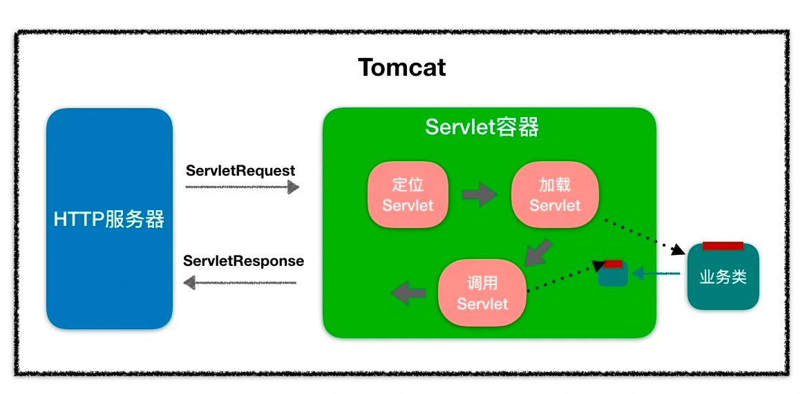
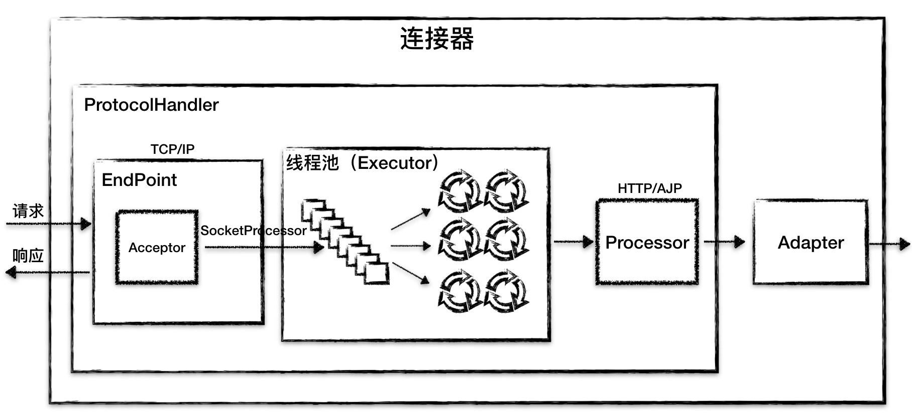

# Tomcat Note

## Servlet 容器和 Spring/SpringMVC 容器之间的关系

Tomcat&Jetty 在启动时给每个 Web 应用创建一个全局的上下文环境，这个上下文就是 ServletContext，其为后面的 Spring 容器提供宿主环境。

Tomcat&Jetty 在启动过程中触发容器初始化事件，Spring 的 ContextLoaderListener 会监听到这个事件，它的 contextInitialized 方法会被调用，在这个方法中，Spring 会初始化全局的 Spring 根容器，这个就是 Spring 的 IoC 容器，IoC 容器初始化完毕后，Spring 将其存储到 ServletContext 中，便于以后来获取。

Tomcat&Jetty 在启动过程中还会扫描 Servlet，一个 Web 应用中的 Servlet 可以有多个，以 SpringMVC 中的 DispatcherServlet 为例，这个 Servlet 实际上是一个标准的前端控制器，用以转发、匹配、处理每个 Servlet 请求。

Servlet 一般会延迟加载，当第一个请求达到时，Tomcat&Jetty 发现 DispatcherServlet 还没有被实例化，就调用 DispatcherServlet 的 init 方法，DispatcherServlet 在初始化的时候会建立自己的容器，叫做 SpringMVC 容器，用来持有 Spring MVC 相关的 Bean。同时，Spring MVC 还会通过 ServletContext 拿到 Spring 根容器，并将 Spring 根容器设为 SpringMVC 容器的父容器，请注意，Spring MVC 容器可以访问父容器中的 Bean，但是父容器不能访问子容器的 Bean， 也就是说 Spring 根容器不能访问 SpringMVC 容器里的 Bean。说的通俗点就是，在 Controller 里可以访问 Service 对象，但是在 Service 里不可以访问 Controller 对象。

## Servlet 容器

### 工作流程

当客户请求某个资源时，HTTP 服务器会用一个 ServletRequest 对象把客户的请求信息封装起来，然后调用 Servlet 容器的 service 方法，Servlet 容器拿到请求后，根据请求的 URL 和 Servlet 的映射关系，找到相应的 Servlet，如果 Servlet 还没有被加载，就用反射机制创建这个 Servlet，并调用 Servlet 的 init 方法来完成初始化，接着调用 Servlet 的 service 方法来处理请求，把 ServletResponse 对象返回给 HTTP 服务器，HTTP 服务器会把响应发送给客户端。同样我通过一张图来帮助你理解。



### Web 应用

Servlet 容器会实例化和调用 Servlet，那 Servlet 是怎么注册到 Servlet 容器中的呢？一般来说，我们是以 Web 应用程序的方式来部署 Servlet 的，而根据 Servlet 规范，Web 应用程序有一定的目录结构，在这个目录下分别放置了 Servlet 的类文件、配置文件以及静态资源，Servlet 容器通过读取配置文件，就能找到并加载 Servlet。Web 应用的目录结构大概是下面这样的：

```text
| -  MyWebApp
| -  WEB-INF/web.xml        -- 配置文件，用来配置Servlet等
| -  WEB-INF/lib/           -- 存放Web应用所需各种JAR包
| -  WEB-INF/classes/       -- 存放你的应用类，比如Servlet类
| -  META-INF/              -- 目录存放工程的一些信息
```

## Tomcat 系统架构

### Connector 连接器


