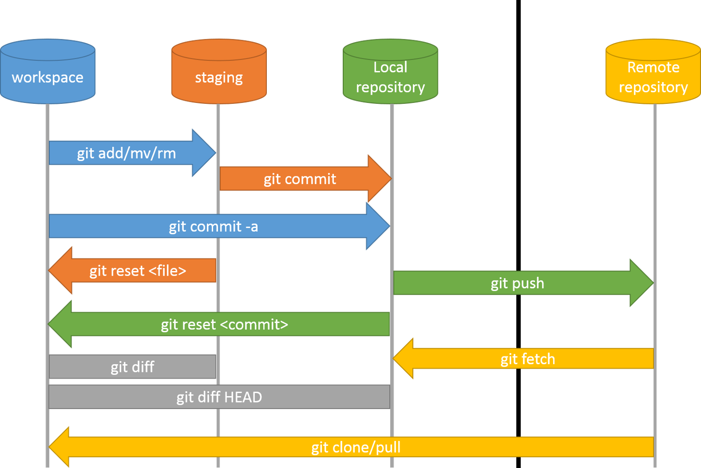
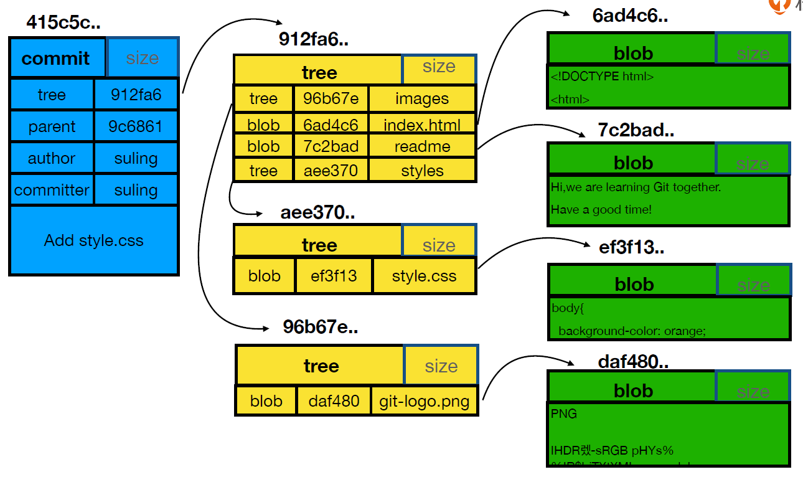

# git笔记
## 1.git基础
##### git 的配置
---
###### config的3个作用域
local:只对仓库有效
global:对登录用户所有仓库有效
system:对系统的所有用户有效
3个作用域的优先级：  

```shell
git config --list --local       # 查看版本库范围的所有设置(若不指定local，则显示所有范围的设置)
git config --list --global      # 查看global范围的设置参数
git config --list --system      # 查看system范围的设置
git config --list user.name     # 只显示user.name的值
git config --local user.name 'username'     # 修改local(版本库)范围的user.name(若不加变量作用域，则默认为local)
git config --global user.email 'email@domain'   # 修改global范围的user.email3
git config --unset varname      # 删除变量
git config --local --edit       # 编辑各域的配置文件(默认为local)
```

---

```shell
git init                        # 初始化版本库
git add filename                # 添加文件至暂存区
git add -u                      # 添加已tracked并修改的文件至暂存区
git add -A                      # 将当前工作区的所有文件add至暂存区
git commit -m 'commit message'  # 提交当前暂存区至历史版本库
```
---
```shell
git status                      # 查看工作区的状态
git log --all --oneline --gragh # 查看版本库的提交历史 
# --all:查看所有分支的提交历史，默认为当前分支 
# --oneline:所有提交历史显示成一行 
# --gragh:图像化的显示提交的历史，若有all选项，则会显示所有分支的演进过程
git log branchname              # 查看指定分支的提交历史，与--all一起使用则无效
git branch -v                   # 显示分支 -v:分支最后一次提交的message
```
---
#### git的结构



---
#### .git目录
* HEAD : 当前的分支的引用(refs/heads/master)
* config : local的配置文件(当前版本库)
* refs : heads 和 tags 
* /refs/heads/master : master指针指向的commit ID
* objects ：git的对象  dirname + filename = object_ID

```shell
git cat-file -t object  # 查看该对象的类型(type)    
git cat-file -p object  # 查看该对象的内容
```
---
#### git的核心对象
1. commit   提交/变更
2. tree     树
3. blob     文件
##### 结构示意图:


一个tree可以包含多个blob和多个tree。一个tree对应一个目录，这个tree会包含这个目录下的所有blob和tree(目录的嵌套)。  
git add 执行后会在.git/objects/中创建对应文件的blob，commit后创建commit和tree

#### 分离HEAD
```shell
git checkout commitID           # 切换HEAD到某个commit，切换分支
```
HEAD->commitID
在此基础上能够继续commit，但若checkout至其他branch,则在头指针分离的情况下的commit会丢失。
#### 分支的创建
```shell
git checkout -b branchname commitID(branch)         # 创建新的分支
git diff HEAD HEAD^             # 比较HEAD和HEAD的父commit的差别
HEAD^2  # 第2个父节点
HEAD~2  # 父节点 的 父节点
```
可以基于某个分支创建新的分支，也能基于某个commit创建新分支。HEAD指向分支 == 指向那个分支最新的commit。

