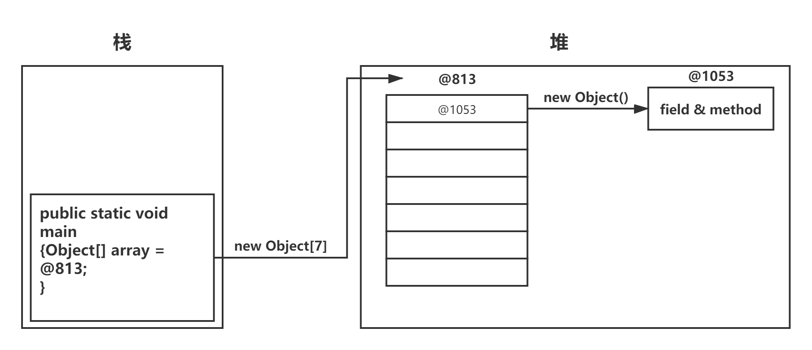
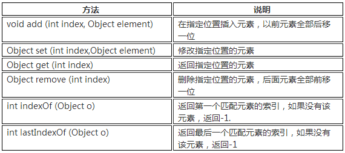
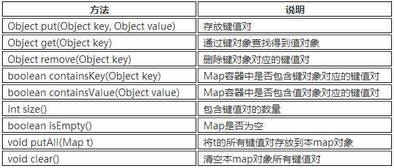

# Java学习笔记

## 学习路线

### 1. 语言的入门和进阶

- [x] Java基础语法
- [ ] OO编程思想
- [x] 集合
- [ ] IO
- [x] 异常
- [ ] 泛型
- [x] 反射
- [ ] 多线程
- [ ] 函数式

### 2.Web基础和工具

- [ ] 前端基础(html/javascript/css) jquery, ajax, jsp, cookie, session
- [ ] http基础
- [ ] servlet基础
- [x] git,svn代码管理工具

### 3.企业级应用框架

- [ ] maven/gradle项目管理工具
- [ ] Spring全家桶(Spring, Spring MVC, Spring Boot)
- [ ] 关系型数据库相关(MySQL, jdbc, MyBatis, Hibernate)
- [ ] 非关系型数据库(Redis)
- [ ] 模板引擎(thymeleaf, freemarker)

### 4.高级应用框架

- [ ] 搜索引擎(elastic search)
- [ ] RPC框架(Dubbo, Spring Cloud)
- [ ] 中间件技术(RabbitMQ, RocketMQ, ActiveMQ, Kafka)
- [ ] 虚拟化技术(Docker, Kubernetes)

### 5.高级话题

- [ ] jvm优化和排错, GC分析, 数据库高级优化

---

### IDEA常用快捷键


---

## 算法

### 冒泡排序

```java

public class ex5_5 {
    public static void main(String[] args) {
        int n = 10;
        int[] array = new int[n];
        for (int i = 0; i < n; i++) {
            array[i] = (int) (Math.random() * 101);
        }
        for (int num :
                array) {
            System.out.print(num + "\t");
        }
        System.out.println();
        int count = 1;
        for (int i = array.length - 1; i > 0; i--) {
            int moveCount = 0;
            for (int j = 0; j < i; j++) {
                int temp;
                if (array[j] > array[j + 1]) {
                    temp = array[j + 1];
                    array[j + 1] = array[j];
                    array[j] = temp;
                    moveCount++;
                }
            }
            System.out.print("\n第" + count + "次排序: \t");
            count++;
            for (int num :
                    array) {
                System.out.print(num + "\t");
            }
            //若数组元素一次都未移动，则不再进行排序
            if (moveCount == 0)
                break;
        }

    }
}

```

## 数值类型之间的转换

```java
int n = 123456789;
float f = n;    // f is 1.2345679E8
```

使用上面两个数值进行二元操作时，先要将两个操作数转换为同一种类型，然后再进行计算。

- 如果两个操作数中有一个是double类型，另一个操作数将会转换成double类型

- 否则，如果其中一个操作数是float类型，另一个操作数将会转换成float类型

- 否则，如果其中一个操作数是long类型，另一个操作数将会转换成long类型

- 否则，两个操作数都将被转换成为int类型

### 强制类型转换

- 若存在信息丢失的可能性，则必须显式的的强制类型转换

## 初始化对象实例域的顺序

1. 所有数据域被初始化为默认值(0、false、null);
2. 按照在类声明中出现的次序，依次执行所有域初始化语句(`private int temp = 20;`)和初始化块(`{temp = 20;}`);
3. 如果构造器第一行调用了第二个构造器，则执行第二个构造器主体(`this(···);`);
4. 执行这个构造器的主体。

## Java中用于控制可见性的4个访问修饰符

1.仅对**本类**可见——`private`
2.对所有类可见——`public`
3.对本包和所有子类可见——`protected`
4.对本包可见——default，不需要修饰符

## 类、超类和子类

> 如果子类的构造器没有显式地调用超类的构造器，则将自动地调用超类默认(没有参数)的构造器。如果超类没有不带参数的构造器，并且在子类的构造器中又没有显式地调用超类的其他构造器，则Java编译器将报告错误。

```java
Object.equals() 比较两个对象变量是否指向同一个引用，Object的equals的作用与==相同
==              比较是否为同一个引用
```

equals()方法的用途是比较两个对象之间的内容是否相等
在两个对象相等(未必是同一个引用)的情况下，其hashCode也应该相等，hashCode应该反映该对象的所有域变量的状态

## 内部类

### 成员内部类

#### 非静态内部类

由于非静态内部类可以访问外部类的实例域，所以一定要在外部类已经实现的情况下才能实现非静态内部类。

>i. 非静态内部类必须寄存在一个外部类对象里。因此，如果有一个非静态内部类对象那么一定存在对应的外部类对象。非静态内部类对象单独属于外部类的某个对象。  
ii. 非静态内部类可以直接访问外部类的成员，但是外部类不能直接访问非静态内部类成员。  
iii. 非静态内部类不能有静态方法、静态属性和静态初始化块。  
iv. 外部类的静态方法、静态代码块不能访问非静态内部类，包括不能使用非静态内部类定义变量、创建实例。  
v. 成员变量访问要点：  
    1.内部类里方法的局部变量：变量名。
    2.内部类属性：this.变量名。  
    3.外部类属性：外部类名.this.变量名。

#### 静态内部类

>ii. 使用要点：  
     1. 当一个静态内部类对象存在，并不一定存在对应的外部类对象。 因此，静态内部类的实例方法不能直接访问外部类的实例方法。  
     2. 静态内部类看做外部类的一个静态成员。 因此，外部类的方法中可以通过：“静态内部类.名字”的方式访问静态内部类的静态成员，通过 new 静态内部类()访问静态内部类的实例。

由于静态内部类不需要实例化，所以无法使用需要实例化的域和方法。

#### 匿名内部类

适合那种只需要使用一次的类。比如：键盘监听操作等等。

1. 匿名内部类没有访问修饰符。
2. 匿名内部类没有构造方法。因为它连名字都没有那又何来构造方法呢。

## 字符串比较

>1. equals方法用来检测两个字符串内容是否相等。如果字符串s和t内容相等，则s.equals(t)返回true，否则返回false。  
>2. 要测试两个字符串除了大小写区别外是否是相等的，需要使用equalsIgnoreCase方法。  
>3. 判断字符串是否相等不要使用"=="。

## 面向对象的内存分析

Java虚拟机的内存可以分为三个区域：栈stack、堆heap、方法区method area。

**栈的特点如下**：

1. 栈描述的是方法执行的内存模型。每个方法被调用都会创建一个栈帧(存储局部变量、操作数、方法出口等)
2. JVM为每个线程创建一个栈，用于存放该线程执行方法的信息(实际参数、局部变量等)
3. 栈属于线程私有，不能实现线程间的共享!
4. 栈的存储特性是“先进后出，后进先出”
5. 栈是由系统自动分配，速度快!栈是一个连续的内存空间!

**堆的特点如下：**

1. 堆用于存储创建好的对象和数组(数组也是对象)
2. JVM只有一个堆，被所有线程共享
3. 堆是一个不连续的内存空间，分配灵活，速度慢!

**方法区(又叫静态区)特点如下：**

1. JVM只有一个方法区，被所有线程共享!
2. 方法区实际也是堆，只是用于存储类、常量相关的信息!
3. 用来存放程序中永远是不变或唯一的内容。(类信息【Class对象】、静态变量、字符串常量等)


### 数组的创建和初始化过程

定义数组只是在栈内存中创建**局部变量**，该变量为指向任何内存空间，即null

```java
Object[] array;
```


创建数组对象，并将数组变量指向堆中创建的数组对象

```java
Object[] array = new Object[7];
```


动态初始化数组

```java
array[0] = new Object();
```



## instanceof

引用变量名 instanceof 类名 来判断该引用类型变量所“指向”的对象是否属于该类或该类的子类。

## 自动装箱和拆箱

由编译器提供的功能，使Java原始类型能够自动的转变为对应的包装类对象。

### 自动装箱

基本类型的数据处于需要对象的环境中时，会自动转为“对象”。

```java
Integer i = 100;//自动装箱
//相当于编译器自动为您作以下的语法编译：
Integer i = Integer.valueOf(100);//调用的是valueOf(100)，而不是new Integer(100)
```

### 自动拆箱

每当需要一个值时，对象会自动转成基本数据类型，没必要再去显式调用intValue()、doubleValue()等转型方法。

```java
Integer i = 100;
int j = i;//自动拆箱
//相当于编译器自动为您作以下的语法编译：
int j = i.intValue();
```

整型、char类型所对应的包装类，在自动装箱时，对于-128~127之间的值会进行缓存处理，其目的是提高效率。

## StringBuild & StringBuffer

>StringBuffer JDK1.0版本提供的类，线程安全，做线程同步检查， 效率较低。  
StringBuilder JDK1.5版本提供的类，线程不安全，不做线程同步检查，因此效率较高。 建议采用该类。

### 常用方法

```java
public StringBuilder append(String str);
public StringBuilder deleteCharAt(int index);
public StringBuilder delete(int start, int end);
public StringBuilder insert(int offset, char c);
public StringBuilder reverse();
public String toString();
```

## 容器

### List

List是有序，元素内容可重复的容器
**有序**:List中每个元素都有索引标记。可以根据元素的索引标记(在List中的位置)访问元素，从而精确控制这些元素。
**可重复**:List允许加入重复的元素。更确切地讲，List通常允许满足 e1.equals(e2) 的元素重复加入容器。
List接口常用的实现类有3个：`ArrayList`、`LinkedList`和`Vector`。



如何选用`ArrayList`、`LinkedList`、`Vector`?

 1. 需要线程安全时，用`Vector`。
 2. 不存在线程安全问题时，并且查找较多用`ArrayList`(一般使用它)。
 3. 不存在线程安全问题时，增加或删除元素较多用`LinkedList`。

#### ArrayList

ArrayList底层是用数组实现的存储。 特点：查询效率高，增删效率低，线程不安全。

#### LinkedList

LinkedList底层用双向链表实现的存储。特点：查询效率低，增删效率高，线程不安全。

#### Vector

Vector底层是用数组实现的List，相关的方法都加了同步检查，因此“线程安全,效率低”。

### Map

Map就是用来存储“键(key)-值(value) 对”的。 Map类中存储的“键值对”通过键来标识，所以“键对象”不能重复。
Map 接口的实现类有`HashMap`、`TreeMap`、`HashTable`、`Properties`等。



#### HashMap

HashMap采用哈希算法实现，是Map接口最常用的实现类。 由于底层采用了哈希表存储数据，我们要求键不能重复，如果发生重复，新的键值对会替换旧的键值对。 HashMap在查找、删除、修改方面都有非常高的效率。
线程不安全，效率高。允许key或value为null。

#### HashTable

线程安全，效率低。不允许key或value为null。

#### TreeMap

TreeMap和HashMap实现了同样的接口Map，因此，用法对于调用者来说没有区别。HashMap效率高于TreeMap;在需要**排序**的Map时才选用TreeMap。

### Set

Set容器特点：无序、不可重复。
**无序**指Set中的元素没有索引，我们只能遍历查找;
**不可重复**指不允许加入重复的元素。更确切地讲，新元素如果和Set中某个元素通过equals()方法对比为true，则不能加入;
甚至，Set中也只能放入一个null元素，不能多个。**对自定义对象排序需要实现Compareable接口**

Set常用的实现类有：`HashSet`、`TreeSet`等，我们一般使用`HashSet`。

#### HashSet

HashSet是采用哈希算法实现，底层实际是用HashMap实现的(HashSet本质就是一个简化版的HashMap)，因此，查询效率和增删效率都比较高。

#### TreeSet

TreeSet底层实际是用TreeMap实现的，内部维持了一个简化版的TreeMap，通过key来存储Set的元素。 TreeSet内部需要对存储的元素进行排序，因此，我们对应的类需要实现Comparable接口。这样，才能根据compareTo()方法比较对象之间的大小，才能进行内部排序。

1. 由于使用排序二叉树实现排序，需要对元素做内部排序。 如果要放入TreeSet中的类没有实现Comparable接口，则会抛出异常：java.lang.ClassCastException。
2. TreeSet中不能放入null元素。(null无法进行比较、排序)

### 遍历结合的方法总结

#### 遍历List

1.普通`for`循环

```java
for(int i=0;i<list.size();i++){//list为集合的对象名
    String temp = (String)list.get(i);
    System.out.println(temp);
}
```

2.增强for循环

```java
for (String temp : list) {
    System.out.println(temp);
}
```

3.Iterator迭代器(1)

```java
for(Iterator iter= list.iterator();iter.hasNext();){
    String temp = (String)iter.next();
    System.out.println(temp);
}
```

4.Iterator迭代器(2)

```java
Iterator  iter =list.iterator();
while(iter.hasNext()){
    Object  obj =  iter.next();
    iter.remove();//如果要遍历时，删除集合中的元素，建议使用这种方式！
    System.out.println(obj);
}
```

#### 遍历Set

1.增强for循环

```java
for(String temp:set){
    System.out.println(temp);
}
```

2.Iterator迭代器

```java
for(Iterator iter = set.iterator();iter.hasNext();){
    String temp = (String)iter.next();
    System.out.println(temp);
}
```

#### 遍历Map

1.根据keySet获取value

```java
Map<Integer, Man> maps = new HashMap<Integer, Man>();
Set<Integer>  keySet =  maps.keySet();
for(Integer id : keySet){
    System.out.println(maps.get(id).name);
}
```

2.遍历entrySet

```java
Set<Entry<Integer, Man>>  ss = maps.entrySet();
for (Iterator iterator = ss.iterator(); iterator.hasNext();) {
    Entry e = (Entry) iterator.next();
    System.out.println(e.getKey()+"--"+e.getValue());
```

## IO

### File类

#### File类 常用方法

##### 路径相关

`File.seoarator` : 操作系统的文件分割符(如Linux的'/'、Windows的'\\')
`getName()` : 获取文件(目录或文件)名
`getPath()` : 获取路径名(即创建File对象时传入的实参)
`getAbsolutePath()` : 永远返回File对象的绝对路径
`getParent()` : 返回父级路径(以传入参数为准)
`getParentFile()` : 返回父级File对象，不存在则为null

---

##### 文件相关

`exists()` : 文件是否存在
`isFile()` : 文件是否是文件
`isDirectory()` : 文件是否是目录文件

`length()` : 文件存储空间大小

`createNewFile()` : 创建文件
`delete()` : 删除文件

---

##### 目录相关

若需要创建的目录已存在，则返回false
`mkdir()` : 创建目录，需保证上一级目录存在，否则创建失败，返回false
`mkdirs()` : 如果父目录不存在则一同创建

`list()` : 列出下级文件名称
`listFiles()` : 返回下级文件对应的File对象(使用绝对路径创建的File对象)
`listRoots()` : 根路径

### 字符集

#### 常用字符集

`utf-8` `utf-16` `utf-16 LE`(小端) `utf-16 BE`(大端) `ISO-8859-1` `GBK`

utf-8中，中文占用3个字节，字母(A to Z 0 to 9)占用1个字节
默认使用项目字符集

#### 编码

字符 --> 字节(二进制)
`"test".getByes()` : 返回字符串对应的`Byte[]`

#### 解码

字节(二进制) --> 字符
解码使用String的构造方法

```java
String(byte bytes[], int offset, int length, Charset charset)
String(byte bytes[], Charset charset)
```

#### 乱码

1. 字节数不够
2. 字符集不统一

### 四个抽象类

#### InputStream

字节输入流的父类，数据单位为字节

#### OutputStream

字节输出流的父类，数据单位为字节

#### Reader

字符输入流的父类，数据单位为字符

#### Writer

字符输出流的父类，数据单位为字符

### IO标准步骤

1. 创建源
2. 选择流
3. 操作
4. 释放系统资源

`FileInputStream` 无法访问目录文件，会抛出 `FileNotFoundException`
