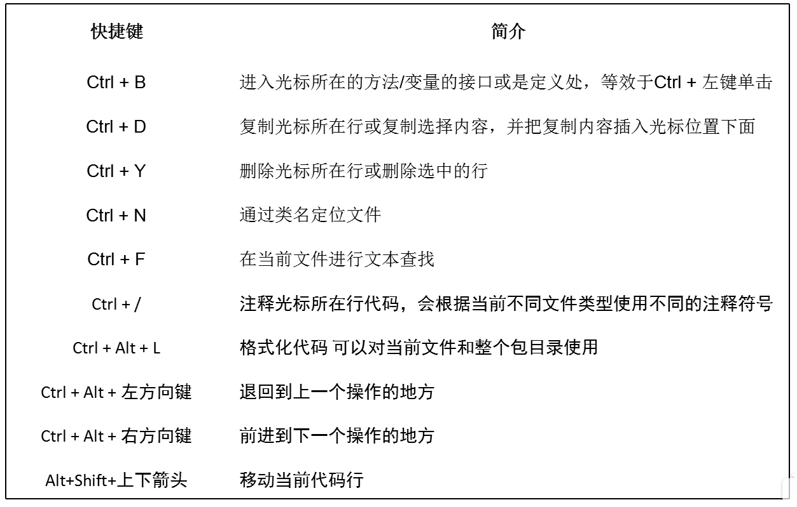
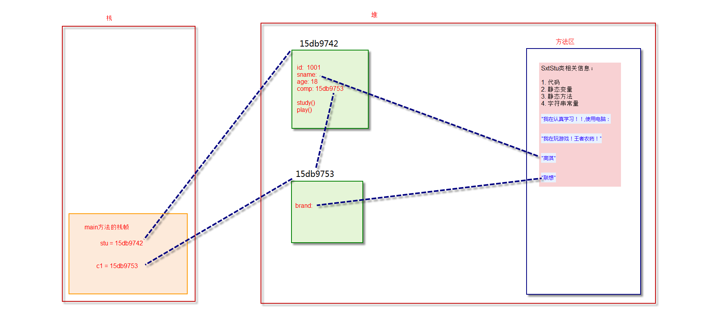

# Java学习笔记

## 学习路线

### 1. 语言的入门和进阶

- [x] Java基础语法
- [ ] OO编程思想
- [ ] 集合
- [ ] IO
- [ ] 异常
- [ ] 泛型
- [ ] 反射
- [ ] 多线程
- [ ] 函数式

### 2.Web基础和工具

- [ ] 前端基础(html/javascript/css) jquery, ajax, jsp, cookie, session
- [ ] http基础
- [ ] servlet基础
- [x] git,svn代码管理工具

### 3.企业级应用框架

- [ ] maven/gradle项目管理工具
- [ ] Spring全家桶(Spring, Spring MVC, Spring Boot)
- [ ] 关系型数据库相关(MySQL, jdbc, MyBatis, Hibernate)
- [ ] 非关系型数据库(Redis)
- [ ] 模板引擎(thymeleaf, freemarker)

### 4.高级应用框架

- [ ] 搜索引擎(elastic search)
- [ ] RPC框架(Dubbo, Spring Cloud)
- [ ] 中间件技术(RabbitMQ, RocketMQ, ActiveMQ, Kafka)
- [ ] 虚拟化技术(Docker, Kubernetes)

### 5.高级话题

- [ ] jvm优化和排错, GC分析, 数据库高级优化

---

### IDEA常用快捷键



---

## 算法

### 冒泡排序

```java

public class ex5_5 {
    public static void main(String[] args) {
        int n = 10;
        int[] array = new int[n];
        for (int i = 0; i < n; i++) {
            array[i] = (int) (Math.random() * 101);
        }
        for (int num :
                array) {
            System.out.print(num + "\t");
        }
        System.out.println();
        int count = 1;
        for (int i = array.length - 1; i > 0; i--) {
            int moveCount = 0;
            for (int j = 0; j < i; j++) {
                int temp;
                if (array[j] > array[j + 1]) {
                    temp = array[j + 1];
                    array[j + 1] = array[j];
                    array[j] = temp;
                    moveCount++;
                }
            }
            System.out.print("\n第" + count + "次排序: \t");
            count++;
            for (int num :
                    array) {
                System.out.print(num + "\t");
            }
            //若数组元素一次都未移动，则不再进行排序
            if (moveCount == 0)
                break;
        }

    }
}

```

## 数值类型之间的转换

```java
int n = 123456789;
float f = n;    // f is 1.2345679E8
```

使用上面两个数值进行二元操作时，先要将两个操作数转换为同一种类型，然后再进行计算。

- 如果两个操作数中有一个是double类型，另一个操作数将会转换成double类型

- 否则，如果其中一个操作数是float类型，另一个操作数将会转换成float类型

- 否则，如果其中一个操作数是long类型，另一个操作数将会转换成long类型

- 否则，两个操作数都将被转换成为int类型

### 强制类型转换

- 若存在信息丢失的可能性，则必须显式的的强制类型转换

## 初始化对象实例域的顺序

1. 所有数据域被初始化为默认值(0、false、null);
2. 按照在类声明中出现的次序，依次执行所有域初始化语句(`private int temp = 20;`)和初始化块(`{temp = 20;}`);
3. 如果构造器第一行调用了第二个构造器，则执行第二个构造器主体(`this(···);`);
4. 执行这个构造器的主体。

## Java中用于控制可见性的4个访问修饰符

1.仅对**本类**可见——`private`
2.对所有类可见——`public`
3.对本包和所有子类可见——`protected`
4.对本包可见——default，不需要修饰符

issue about array of object

```java
Employee[] employee = new Employee[10];
Employee[] employee;
object.equals  &&   ==  区别
```

## 类、超类和子类

> 如果子类的构造器没有显式地调用超类的构造器，则将自动地调用超类默认(没有参数)的构造器。如果超类没有不带参数的构造器，并且在子类的构造器中又没有显式地调用超类的其他构造器，则Java编译器将报告错误。

```java
Object.equals() 比较两个对象变量是否指向同一个引用，Object的equals的作用与==相同
==              比较是否为同一个引用
```

equals()方法的意义在于比较两个对象是否相同(比较两个对象的主键)

## 内部类

### 成员内部类

#### 非静态内部类

由于非静态内部类可以访问外部类的实例域，所以一定要在外部类已经实现的情况下才能实现非静态内部类。

>i. 非静态内部类必须寄存在一个外部类对象里。因此，如果有一个非静态内部类对象那么一定存在对应的外部类对象。非静态内部类对象单独属于外部类的某个对象。  
ii. 非静态内部类可以直接访问外部类的成员，但是外部类不能直接访问非静态内部类成员。  
iii. 非静态内部类不能有静态方法、静态属性和静态初始化块。  
iv. 外部类的静态方法、静态代码块不能访问非静态内部类，包括不能使用非静态内部类定义变量、创建实例。  
v. 成员变量访问要点：  
    1.内部类里方法的局部变量：变量名。    
    2.内部类属性：this.变量名。  
    3.外部类属性：外部类名.this.变量名。

#### 静态内部类

>ii. 使用要点：  
     1. 当一个静态内部类对象存在，并不一定存在对应的外部类对象。 因此，静态内部类的实例方法不能直接访问外部类的实例方法。  
     2. 静态内部类看做外部类的一个静态成员。 因此，外部类的方法中可以通过：“静态内部类.名字”的方式访问静态内部类的静态成员，通过 new 静态内部类()访问静态内部类的实例。
由于静态内部类不需要实例化，所以无法使用需要实例化的域和方法。

#### 匿名内部类

适合那种只需要使用一次的类。比如：键盘监听操作等等。
1. 匿名内部类没有访问修饰符。
2. 匿名内部类没有构造方法。因为它连名字都没有那又何来构造方法呢。

## 字符串比较

>   1. equals方法用来检测两个字符串内容是否相等。如果字符串s和t内容相等，则s.equals(t)返回true，否则返回false。  
    2. 要测试两个字符串除了大小写区别外是否是相等的，需要使用equalsIgnoreCase方法。  
    3. 判断字符串是否相等不要使用"=="。

## 面向对象的内存分析

Java虚拟机的内存可以分为三个区域：栈stack、堆heap、方法区method area。

**栈的特点如下：**
　　1. 栈描述的是方法执行的内存模型。每个方法被调用都会创建一个栈帧(存储局部变量、操作数、方法出口等)
　　2. JVM为每个线程创建一个栈，用于存放该线程执行方法的信息(实际参数、局部变量等)
　　3. 栈属于线程私有，不能实现线程间的共享!
　　4. 栈的存储特性是“先进后出，后进先出”
　　5. 栈是由系统自动分配，速度快!栈是一个连续的内存空间!
**堆的特点如下：**
　　1. 堆用于存储创建好的对象和数组(数组也是对象)
　　2. JVM只有一个堆，被所有线程共享
　　3. 堆是一个不连续的内存空间，分配灵活，速度慢!
**方法区(又叫静态区)特点如下：**
　　1. JVM只有一个方法区，被所有线程共享!
　　2. 方法区实际也是堆，只是用于存储类、常量相关的信息!
　　3. 用来存放程序中永远是不变或唯一的内容。(类信息【Class对象】、静态变量、字符串常量等)



