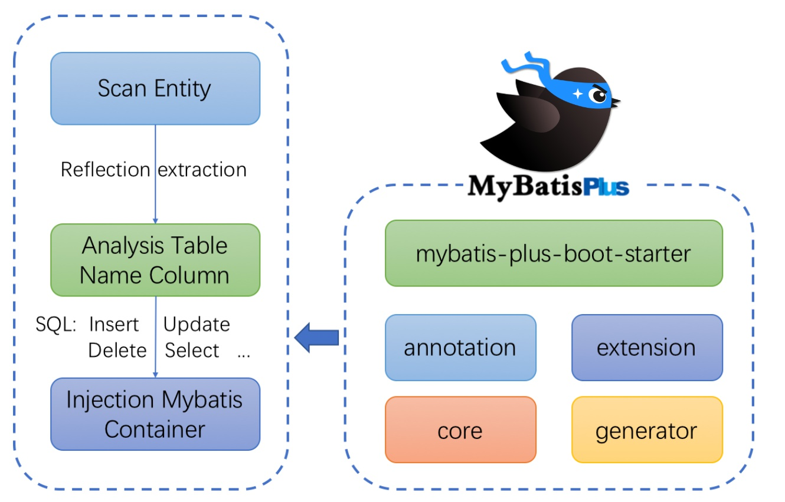

# Mybatis Plus 笔记

## Mybatis Plus 介绍

### 框架结构



### 特性

- 无入侵、损耗小、强大的CRUD操作
- 支持Lambda形式调用、支持多种数据库(MySQL、Oracle)
- 支持主键自动生成、支持ActiveRecord模式
- 支持自定义全局通用操作、支持关键词自动转义
- 内置代码生成器、内置分页插件、内置性能分析插件
- 内置全局拦截插件、内置SQL注入剥离器

## HelloWorld

- 执行建表SQL

```sql
# 创建用户表
CREATE TABLE user (
    id BIGINT(20) PRIMARY KEY NOT NULL COMMENT '主键',
    name VARCHAR(30) DEFAULT NULL COMMENT '姓名',
    age INT(11) DEFAULT NULL COMMENT '年龄',
    email VARCHAR(50) DEFAULT NULL COMMENT '邮箱',
    manager_id BIGINT(20) DEFAULT NULL COMMENT '直属上级id',
    create_time DATETIME DEFAULT NULL COMMENT '创建时间',
    CONSTRAINT manager_fk FOREIGN KEY (manager_id) REFERENCES user (id)
)  ENGINE=INNODB CHARSET=UTF8;

# 初始化数据：
INSERT INTO user (id, name, age, email, manager_id, create_time)
VALUES
    (1087982257332887553, '大boss', 40, 'boss@baomidou.com', NULL, '2019-01-11 14:20:20'),
    (1088248166370832385, '王天风', 25, 'wtf@baomidou.com', 1087982257332887553, '2019-02-05 11:12:22'),
    (1088250446457389058, '李艺伟', 28, 'lyw@baomidou.com', 1088248166370832385, '2019-02-14 08:31:16'),
    (1094590409767661570, '张雨琪', 31, 'zjq@baomidou.com', 1088248166370832385, '2019-01-14 09:15:15'),
    (1094592041087729666, '刘红雨', 32, 'lhm@baomidou.com', 1088248166370832385, '2019-01-14 09:48:16');
```

- 引入Mybatis Plus依赖

```xml
<dependency>
    <groupId>com.baomidou</groupId>
    <artifactId>mybatis-plus-boot-starter</artifactId>
    <version>3.3.0</version>
</dependency>
```

- 创建实体类

```java
@Data
public class User {
    // 主键
    private Long id;
    // 姓名
    private String name;
    // 年龄
    private Integer age;
    // 邮箱
    private String email;
    // 直属上级
    private Long managerId;
    // 创建时间
    private LocalDateTime createTime;
}
```

- 创建Mapper接口并继承BaseMapper<>

```java
public interface UserMapper extends BaseMapper<User> {
}
```

- Spring启动类添加MapperScan注解，扫描指定路径下所有的接口的代理实现类并注入容器中

```java
@SpringBootApplication
@MapperScan("com.wuyue.**.mapper")
public class MpApplication {
    public static void main(String[] args) {
        SpringApplication.run(MpApplication.class, args);
    }
}
```

- 测试类

```java
@SpringBootTest
@RunWith(SpringRunner.class)
class MpApplicationTests {

    @Autowired
    private UserMapper userMapper;

    @Test
    public void select() {
        List<User> users = userMapper.selectList(null);
        users.forEach(System.out::println);
    }
}
```

## 基本使用

### 通用Mapper

#### 新增方法

```java
@Test
public void testInsert() {
    User user = new User(1094592041087722630L,
                        "哈哈",
                        18,
                        null,
                        1087982257332887553L,
                        LocalDateTime.now());
    int rows = userMapper.insert(user);
    System.out.println("affect rows: " + rows);
}
```

**MP插入及更新字段策略**：
在实体类属性为null时，不插入或更新该字段。

#### 常用注解

- MP默认将实体类的驼峰属性名、类名映射为下划线分割的数据库字段名及表名。
- MP中默认向名为id的实体类属性中使用雪花算法添加主键内容

```java
@TableName("mp_user")
public class User {
    // 主键
    @TableId("id")
    private Long userId;

    // 姓名
    @TableField("name")
    private String realName;

    // 年龄
    private Integer age;

    // 邮箱
    private String email;

    // 直属上级
    private Long managerId;

    // 创建时间
    private LocalDateTime createTime;
}
```

##### @TableName

若数据库表名与实体类名不一致，可以通过`@TableName`注解，直接指定数据库表名。

```java
@TableName("mp_user")
public class User {
    ...
}
```

##### @TableId

被标注的实体类属性为表的主键，value为映射的数据库字段名。若该属性为null，则默认使用雪花算法向其中写入主键的值。

```java
// 主键
@TableId("id")
private Long userId;
```

##### @TableField

指定实体类属性对应的数据库字段名。

```java
// 姓名
@TableField("name")
private String realName;
```

#### 排除非表字段的三种方式

若实体类中存在数据库中不存在的字段，可以通过以下三种方法忽略实体类中的字段。

##### transient

为实体类属性添加`transient`关键字，在不对该字段进行序列化的同时，也忽略该属性的CRUD操作。

```java
private transient String remark;
```

##### static

为实体类属性添加`static`关键字，忽略该属性的CRUD操作。

```java
private static String remark;
```

##### @TableField(exist = false)

为实体类属性添加`@TableField(exist = false)`注解，推荐使用。

```java
@TableField(exist = false)
private String remark;
```

#### 查询方法 Retrieve

##### 基本查询方法

###### selectById

根据主键查询，返回实体类对象

```java
T selectById(Serializable id);
```

```java
User user = userMapper.selectById(1087982257332887553L);
```

包装类均实现了`Serializable`接口

查询SQL为：

```sql
SELECT user_id,name AS realName,age,email,manager_id,create_time FROM mp_user WHERE user_id = #{id}
```

###### selectBatchIds

根据多个主键查询

```java
List<T> selectBatch(List<T> ids)
```

```java
Collection<? extends Serializable> idList = Arrays.asList(1087982257332887553L,
        1094590409767661570L,
        1094592041087729666L);
List<User> users = userMapper.selectBatchIds(idList);
```

查询SQL为：

```sql
SELECT user_id,name AS realName,age,email,manager_id,create_time FROM mp_user WHERE user_id IN ( #{param1} , #{param2} , #{param3} )
```

###### selectByMap

根据传入的Map查询符合所有条件的记录，Map中的key为数据库中的列名（如果输入的是实体类中的属性名会报错）、value是列对应的值。Map中键值对之间的关系是`and`。

```java
List<T> selectByMap(Map<key,value> map)
```

```jaav
Map<String, Object> columnMap = new HashMap<>();
columnMap.put("name", "test001");
columnMap.put("age", 30);
List<User> users = userMapper.selectByMap(columnMap);
```

查询SQL为：

```sql
SELECT user_id,name AS realName,age,email,manager_id,create_time FROM mp_user WHERE name = #{name} AND age = #{age}
```

###### 条件构造器为参数的查询方法


