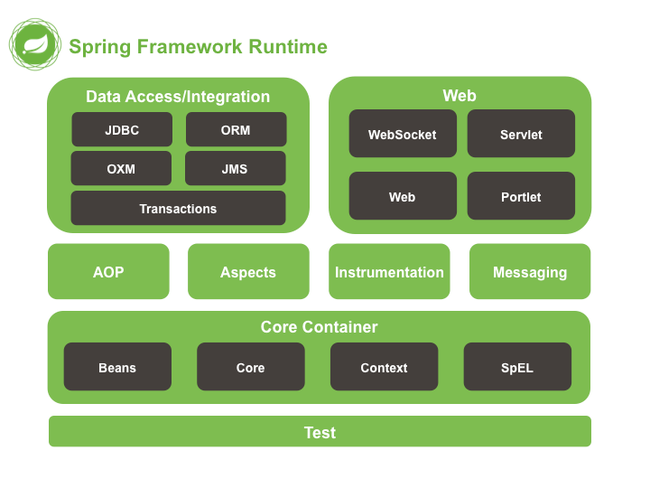

# Spring 笔记

## Spring模块



## pom配置

```xml
<dependencies>
    <dependency>
        <groupId>org.springframework</groupId>
        <artifactId>spring-context</artifactId>
        <version>5.2.4.RELEASE</version>
    </dependency>
</dependencies>
 ```

## IOC/DI

### IOC:(Inversion(反转) Of Control) 控制反转

- 控制:
  - 资源的获取方式:
    主动式：创建需要的对象

    ```java
    Person person = new Person();
    ```

  - 被动式：资源的获取不是我们自己创建，而是交给一个容器来创建和设置

  ```java
  BookServlet{
          BookService bs;
          public void test01(){
              bs.checkout();
          }
  }
  ```

- 容器：管理所有的组件（有功能的类）；假设，BookServlet受容器管理，BookService也受容器管理；容器可以自动的探查出那些组件（类）需要用到另一写组件（类）；容器帮我们创建BookService对象，并把BookService对象赋值过去；将主动的new资源变为被动的接受资源；

### DI:(Dependency Injection) 依赖注入

容器能知道哪个组件（类）运行的时候，需要另外一个类（组件）；容器通过反射的形式，将容器中准备好的BookService对象注入（利用反射给属性赋值）到BookServlet中；

只要IOC容器管理的组件，都能使用容器提供的强大功能；

## IOC容器的使用

**步骤**:

1. 在配置文件中注册组件
2. 使用ClassPathXMLApplicationContext()实例化IOC容器
3. 通过IOC容器获取指定的对象

### 组件的注册

使用`<bean>`标签实例化一个对象

```xml
<bean id="person01" class="com.wuyue.domain.Person">
```

- 属性:
  - class: 要注册的组件的类全限定名
  - id: 这个对象在IOC容器中的唯一标识

**等价于**:

```java
Person person01 = new Person()
```

#### 通过\<property\>标签为指定的bean属性赋值

```xml
<bean id="person01" class="com.wuyue.domain.Person">
    <property name="name" value="wuyue"/>
    <property name="age" value="18"/>
    <property name="email" value="wuyue@wuyue.com"/>
    <property name="gender" value="m"/>
</bean>

<bean id="person02" class="com.wuyue.domain.Person">
    <property name="name" value="nini"/>
</bean>

```

- property属性:
  - name: bean对象的属性名
  - value: 属性值(该属性的数据类型只能是Java原生数据类型，这样IOC才能正确的进行自动类型转换(将xml中的String转为属性的真实数据类型))

IOC通过bean类的setter/getter方法的方法名来判断属性名，即 setUserName() --> userName ，所以setter/getter方法名发生改变会导致bean的属性也发生变化，属性名是有setter和getter方法决定的，而不是bean的实例域决定的

property标签等价于java中的 `person.setProperty();` 调用已实例化的对象中的setter方法为指定的属性赋值

#### 使用bean的构造构造方法完成实例化

```xml
<bean id="person03" class="com.wuyue.domain.Person">
    <constructor-arg name="age" value="19"/>
    <constructor-arg name="email" value="spring@test.com"/>
    <constructor-arg name="gender" value="f"/>
    <constructor-arg name="name" value="spring"/>
</bean>
<bean id="person04" class="com.wuyue.domain.Person">
    <constructor-arg value="妮妮"/>
    <constructor-arg value="24"/>
    <constructor-arg value="nini@test.com" index="3"/>
    <constructor-arg value="f"/>
</bean>
```

调用组件的有参构造器完成对象的实例化
constructor-arg标签的数量应与构造器的形参数量一致

- 属性:
  - name: 构造器形参名
  - value: 简单数据类型的值
  - index: 该标签对应构造器中参数的索引位置

其中的name属性可以省略，constructor-arg标签中的值应与构造器参数的位置相对应

#### 通过p命名空间为bean赋值

#### bean的继承

**NOTE**: 使用parent属性继承的引用类型对象是父类真实对象的一个深克隆，即 对引用类型成员变量的修改不会影响父类中该成员变量的值

#### 使用工厂模式创建实例

#### 使用静态工厂创建实例

```xml
<bean class="com.wuyue.factory.CarStaticFactory" id="carStaticFactory" factory-method="getCar">
    <constructor-arg value="5000"/>
</bean>
```

#### 使用实例工厂创建实例

```xml
<bean class="com.wuyue.factory.CarInstanceFactory" id="carInstanceFactory"/>
<bean class="com.wuyue.domain.Car" id="car" factory-bean="carInstanceFactory" factory-method="getCar">
    <constructor-arg value="800000"/>
</bean>
```

先创建工厂实例，再调用工程实例创建对象

#### 使用FactoryBean实现类工厂创建实例

```xml
<bean class="com.wuyue.factory.CarFactoryWithBean" id="car2"/>
```

```java
public class CarFactoryWithBean implements FactoryBean<Car> {
    @Override
    public Car getObject() throws Exception {
        Car car = new Car();
        car.setCarName("Benz");
        return car;
    }

    @Override
    public Class<?> getObjectType() {
        return Car.class;
    }

    @Override
    public boolean isSingleton() {
        return true;
    }
}
```

在配置文件中直接注册这个工厂类即可，能够直接从IOC容器获取实例
**NOTE**: 使用FactoryBean实现类工厂创建实例，不论是否是单实例，该工厂都只在获取实例对象的时候才会创建对象。
不同于普通的单例模式，在IOC容器初始化完成之前就创建实例
