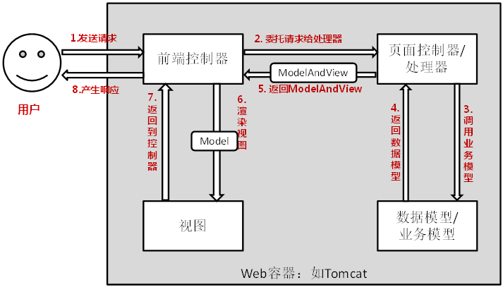
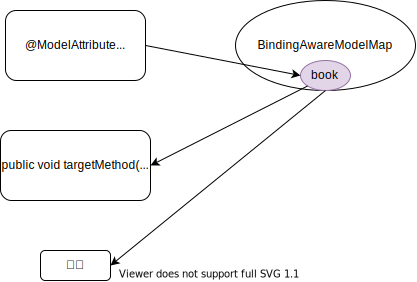
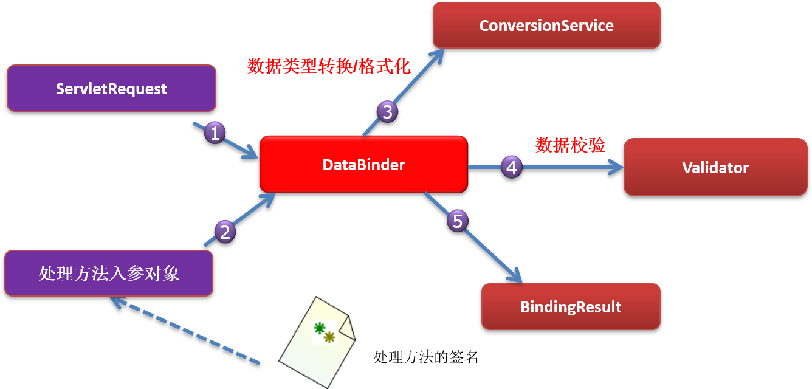
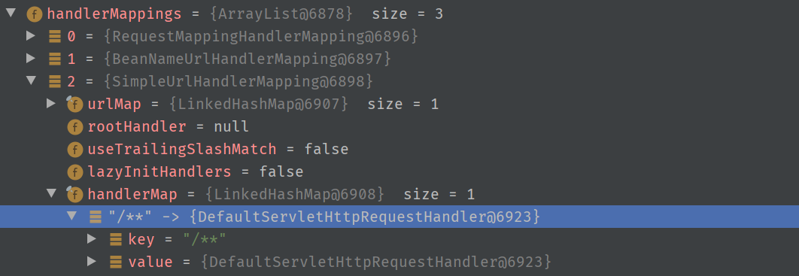
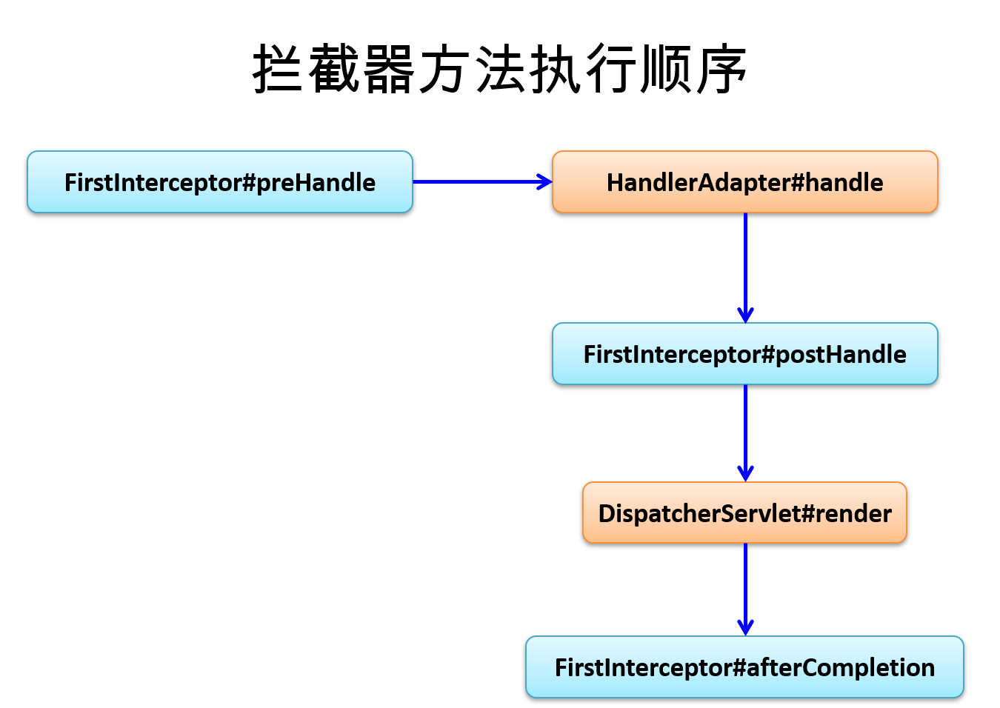
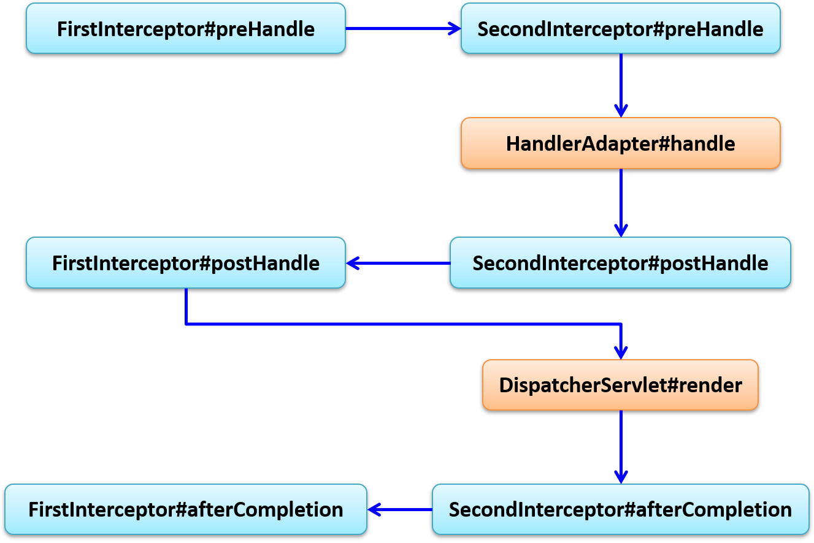
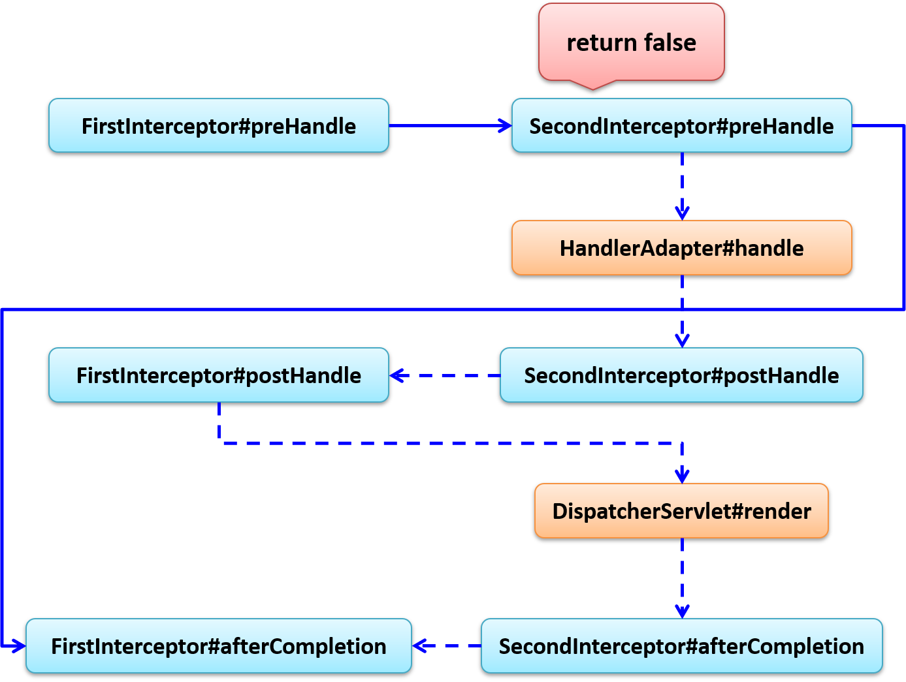

# SpringMVC笔记

## SpringMVC简介

Spring 为展现层提供的基于 MVC 设计理念的优秀的 Web 框架，是目前最主流的 MVC 框架之一

SpringMVC属于Spring框架中的web模块


## HelloWorld

**流程**:
1 导包

```text
日志记录
commons-logging-1.1.3.jar
支持注解
spring-aop-4.0.0.RELEASE.jar

Spring核心容器模块
spring-beans-4.0.0.RELEASE.jar
spring-context-4.0.0.RELEASE.jar
spring-core-4.0.0.RELEASE.jar
spring-expression-4.0.0.RELEASE.jar

Spring Web模块
spring-web-4.0.0.RELEASE.jar
spring-webmvc-4.0.0.RELEASE.jar
```

2 写配置

配置springmvc的前端控制器，指定springmvc配置文件位置

**WEB-INF/web.xml**:

```xml
<!-- SpringMVC思想是有一个前端控制器能拦截所有请求，并智能派发;
  	这个前端控制器是一个servlet；应该在web.xml中配置这个servlet来拦截所有请求
   -->

<!-- The front controller of this Spring Web application, 
responsible for handling all application requests -->
<servlet>
    <servlet-name>springDispatcherServlet</servlet-name>
    <servlet-class>org.springframework.web.servlet.DispatcherServlet</servlet-class>

    <init-param>
        <!-- contextConfigLocation:指定SpringMVC配置文件位置 -->
        <param-name>contextConfigLocation</param-name>
        <param-value>classpath:springmvc.xml</param-value>
    </init-param>
    <!-- servlet启动加载，servlet原本是第一次访问创建对象；
    load-on-startup:服务器启动的时候创建对象；值越小优先级越高，越先创建对象；
        -->
    <load-on-startup>1</load-on-startup>
</servlet>

<!-- Map all requests to the DispatcherServlet for handling -->
<servlet-mapping>
    <servlet-name>springDispatcherServlet</servlet-name>
    <!--  
        /*和/都是拦截所有请求； /：会拦截所有请求，但是不会拦截*.jsp；能保证jsp访问正常；
        /*的范围更大；还会拦截到*.jsp这些请求；一但拦截jsp页面就不能显示了；
        -->
    <url-pattern>/</url-pattern>
</servlet-mapping>
```

3 使用注解标注控制器

```java
@Controller
public class MyFirstController {
/**
    *   @RequestMapping:告诉SpringMVC这个方法处理什么请求；
    *   / 代表从当前项目下开始；处理当前项目下的hello请求
    */
@RequestMapping("/hello")
public String myfirstRequest(){
    System.out.println("请求收到了....正在处理中");
    //视图解析器自动拼串；
    //<property name="prefix" value="/WEB-INF/pages/"></property>
    //<property name="suffix" value=".jsp"></property>
    //   (前缀)/WEB-INF/pages/+返回值(success)+后缀（.jsp）
    return "success";
}
```

(配置视图解析器用于页面地址的拼接)

**spring.xml**:

```xml
<!-- 配置一个视图解析器 ；能帮我们拼接页面地址-->
<bean class="org.springframework.web.servlet.view.InternalResourceViewResolver">
    <property name="prefix" value="/WEB-INF/pages/"></property>
    <property name="suffix" value=".jsp"></property>
</bean>
```

**配置总结**:

1. 配置依赖
2. 配置web.xml,使前置控制器拦截所有在web.xml没有匹配到url-pattern的请求
3. 配置Spring.xml,开启自动注解扫描(,配置视图解析器,用于请求转发时的url拼串)
4. 为控制器添加注解(@Controller/@RequestMapping)

**运行流程**:



1. 客户端请求提交到DispatcherServlet
2. 由DispatcherServlet控制器查询一个或多个HandlerMapping，找到处理请求的Controller
3. DispatcherServlet将请求提交到Controller（也称为Handler）
4. Controller调用业务逻辑处理后，返回ModelAndView
5. DispatcherServlet查询一个或多个ViewResoler视图解析器，找到ModelAndView指定的视图
6. 视图负责将结果显示到客户端

1）、客户端点击链接会发送 `http://localhost:8080/springmvc/hello` 请求  
2）、来到tomcat服务器；  
3）、SpringMVC的前端控制器收到所有请求；  
4）、来看请求地址和@RequestMapping标注的哪个匹配，来找到到底使用那个类的哪个方法来处理  
5）、前端控制器找到了目标处理器类和目标方法，直接利用返回执行目标方法；  
6）、方法执行完成以后会有一个返回值；SpringMVC认为这个返回值就是要去的页面地址  
7）、拿到方法返回值以后；用视图解析器进行拼串得到完整的页面地址；  
8）、拿到页面地址，前端控制器帮我们转发到页面；  

**RequestMapping**:
@RequestMapping；  
就是告诉SpringMVC；这个方法用来处理什么请求；  
这个/是可以省略，即使省略了，也是默认从当前项目下开始；  
习惯加上比较好    /hello  /hello  
一个请求路径只能由一个方法处理,否则抛异常  

**默认配置文件位置**:
如果不指定配置文件位置？  
如果不指定也会默认去找一个文件；  
就在web应用的/WEB-INF下创建一个名叫`前端控制器名-servlet.xml`  

**url-pattern**:

`/`: 拦截所有请求，不拦截jsp页面，*.jsp请求  
`/*`: 拦截所有请求，拦截jsp页面，*.jsp请q  
处理`*.jsp`是tomcat做的事；所有项目的小web.xml都是继承于大web.xml(Tomcat全局web配置)  
DefaultServlet是Tomcat中处理静态资源的Servlet  
除过jsp，和servlet外剩下的都是静态资源；  
index.html：静态资源，tomcat就会在服务器下找直接到这个资源并返回;  
我们前端控制器的/禁用了tomcat服务器中的DefaultServlet  
1）服务器的大web.xml中有一个DefaultServlet是url-pattern=/  
2）我们的配置中前端控制器 url-pattern=/  
静态资源会来到DispatcherServlet（前端控制器）看那个方法的RequestMapping是这个index.html  
3）为什么jsp又能访问；因为我们没有覆盖服务器中的JspServlet的配置  
4） `/*`  直接就是拦截所有请求；我们写`/`；也是为了迎合后来Rest风格的URL地址  

## Tomcat url-pattern匹配规则

详情: [Servlet容器Tomcat中web.xml中url-pattern的配置详解[附带源码分析]](https://www.cnblogs.com/fangjian0423/p/servletcontainer-tomcat-urlpattern.html)

用户请求这里进行url匹配的时候是有优先级的。 我们从上到下以优先级的高低进行说明：

规则1：精确匹配，使用contextVersion的exactWrappers (url-pattern直接写明路径)  
规则2：前缀匹配，使用contextVersion的wildcardWrappers (url-pattern以`/*`结尾)  
规则3：扩展名匹配，使用contextVersion的extensionWrappers (url-pattern以`*.`开始,如JspServlet)  
规则4：使用资源文件来处理servlet，使用contextVersion的welcomeResources属性，这个属性是个字符串数组  
规则7：使用默认的servlet，使用contextVersion的defaultWrapper (url-pattern == `/`,如DefaultServlet,用于加载静态资源)  

根据上述url匹配优先级:  
若Spring的前端控制器的url-pattern为`/*`,前缀匹配优先级高于扩展名匹配,所以原本由JspServlet(`url-pattern=*.jsp`)处理的jsp资源请求将被Spring的前端控制器处理,从而不能正确返回jsp页面

## @RequestMapping

@RequestMapping可以标注在**类**和**方法**上,标注在类上表示为当前类所有的方法的请求地址指定一个基准路径

```java
@RequestMapping("test")
@Controller
public class RequestMappingController {

    @RequestMapping("/handle01")
    public String handle01() {
        System.out.println("RequestMappingController.handle01");
        return "success";
    }
}
```

若要调用handle01方法,则要访问路径为`/test/handle01`,@RequestMapping()中的路径中的`/`可以省略,层级关系之间能够自动加入`/`进行分割

### 属性

#### method

限定请求方式  
HTTP协议中的所有请求方式：  
【GET】, HEAD, 【POST】, PUT, PATCH, DELETE, OPTIONS, TRACE  
method=RequestMethod.POST：只接受这种类型的请求，默认是什么都可以；  
@RequestMapping(value = "/handle01", method = {RequestMethod.POST, RequestMethod.GET})  
不是规定的方式报错：4xx:都是客户端错误  
405 - Request method 'GET' not supported

#### param

params：规定请求参数  
params 和 headers支持简单的表达式：

param1: 表示请求必须包含名为 param1 的请求参数  
eg：params={"username"}:  
发送请求的时候必须带上一个名为username的参数；没带都会400

---
!param1: 表示请求不能包含名为 param1 的请求参数  
eg:params={"!username"}  
发送请求的时候必须不携带上一个名为username的参数；带了都会400

---
param1 != value1: 表示请求包含名为 param1 的请求参数，但其值不能为 value1  
eg：params={"username!=123"}  
发送请求的时候;携带的username值必须不是123(不带username或者username不是123)

---
{“param1=value1”, “param2”}: 请求必须包含名为 param1 和param2 的两个请求参数，且 param1 参数的值必须为 value1  
eg:params={"username!=123","pwd","!age"}  
`@RequestMapping(value = "/handle02", params = {"username=123", "age!=88", "!sex"})`
请求参数必须满足以上规则；  
请求的username不能是123，必须有pwd的值，不能有age  

**NOTE**: param指定的参数是url上的参数,不规定post请求体中的参数,也就是说param属性是用来规定**请求行(GET请求参数)** 的

#### header

规定请求头的各个字段及其值,也和params属性一样能写简单的表达式

`@RequestMapping(value = "/handle03", header = {"user-agent=...", "...", ...})`

#### consumes

只接受内容类型是哪种的请求，规定请求头中的Content-Type

#### produces

告诉浏览器返回的内容类型是什么，给响应头中加上Content-Type:text/html;charset=utf-8

### ant风格的url

URL地址可以写模糊的通配符：  
`?` : 能替代任意一个字符  
`*` : 能替代任意多个字符，和一层路径  
`**` : 能替代多层路径  

## 请求参数获取

### @PathVariable 路径上的占位符

`@RequestMapping`上的URL可以使用占位符,占位符的值能够作为参数传给控制器方法

语法就是可以在任意路径的地方写一个{变量名}  
**NOTE**: 路径上的占位符只能占一层路径,url匹配时占位符优先级最高

```java
@RequestMapping("/{username}")
public String handle03(@PathVariable("username") String username) {
    System.out.println("占位符为: " + username);
    return "success";
}
```

### REST风格的URL地址约束

使用简洁的URL提交请求，以请求方式区分对资源操作

|URL|请求方法|操作|
|--|--|--|
|books/1|GET|获取一号图书的资源|
|books/1|PUT|更新一号图书的资源|
|books/1|DELETE|删除一号图书的资源|
|books|POST|插入一个图书记录|

URL使用`/资源名/资源标识符`的形式,CRUD操作通过请求方法来进行区分

**实现代码**:

```java
@Controller
public class BookController {
    /**
     * 处理查询图书请求
     * @param id
     * @return
     */
    @RequestMapping(value="/book/{bid}",method=RequestMethod.GET)
    public String getBook(@PathVariable("bid")Integer id) {
        System.out.println("查询到了"+id+"号图书");
        return "success";
    }

    /**
     * 图书删除
     * @param id
     * @return
     */
    @RequestMapping(value="/book/{bid}",method=RequestMethod.DELETE)
    public String deleteBook(@PathVariable("bid")Integer id) {
        System.out.println("删除了"+id+"号图书");
        return "success";
    }

    /**
     * 图书更新
     * @return
     */
    @RequestMapping(value="/book/{bid}",method=RequestMethod.PUT)
    public String updateBook(@PathVariable("bid")Integer id) {
        System.out.println("更新了"+id+"号图书");
        return "success";
    }

    @RequestMapping(value="/book",method=RequestMethod.POST)
    public String addBook() {
        System.out.println("添加了新的图书");
        return "success";
    }
}
```

由于jsp只能发送GET和POST请求,无法发送DELETE和PUT请求,所以需要使用spring提供的filter来将请求在交给controller处理前修改请求方法

`HiddenHttpMethodFilter`拦截所有请求,如果请求是POST方式,并且有`_method`属性,则将HttpRequest中的method属性值改为指定的请求方法,然后放行.否则直接放行

```xml
<filter>
    <filter-name>HiddenHttpMethodFilter</filter-name>
    <filter-class>org.springframework.web.filter.HiddenHttpMethodFilter</filter-class>
</filter>

<filter-mapping>
    <filter-name>HiddenHttpMethodFilter</filter-name>
    <url-pattern>/*</url-pattern>
</filter-mapping>
```

jsp中的DELETE和PUT请求的提交方式:

```html
<!-- 普通GET请求 -->
<a href="book/1">查询图书</a>
<br/>

<!-- 普通POST请求 -->
<form action="book" method="post">
    <input type="submit" value="添加1号图书"/>
</form>
<br/>

<!-- 发送DELETE请求 -->
<!-- 在表单中添加_method属性,并指定请求方式 -->
<form action="book/1" method="post">
    <input name="_method" value="delete"/>
    <input type="submit" value="删除1号图书"/>
</form><br/>

<!-- 发送PUT请求 -->
<!-- 在表单中添加_method属性,并指定请求方式 -->
<form action="book/1" method="post">
    <input name="_method" value="put"/>
    <input type="submit" value="更新1号图书"/>
</form><br/>
```

### 高版本的Tomcat的RestCURD不接收DELETE和PUT请求方法

由于高版本Tomcat只能接收GET和POST请求方法,不接受DELETE和PUT,所以导致了405  
可以将jsp页面设置为errorpage,这样tomcat的异常将不会抛出  

### @RequestParam

SpringMVC默认方式获取请求参数: 直接给方法上写一个和请求参数同名的变量,这个变量来接收请求参数的值  
如果请求存在这个参数则传入这个参数,如果没有这个参数,则传入null

`@RequestParam`注解可以标注方法的形参,表示该形参传入的是`@RequestParam`指定的请求参数值,这个指定的请求参数在请求中必须携带,否则`HTTP Status 400 - Required String parameter 'RequestParameter' is not present`

属性`required`可以指定这个请求参数是否是必须的,默认为true.该为false后,若请求参数不存在这传入null

属性`defaultValue`指定没有指定请求参数时,传入的值

```java
public String handle01(@RequestParam(value = "username", required = false, defaultValue = "noParam") String user) {}
```

<==>

```java
String user = request.getParameter("username") != null ? request.getParameter("username") : "noParam";
```

#### 和@PathVariable的区别

@PathVariable是用于获取url路径上的值,而@RequestParam用于获取请求参数的值

### @RequestHeader

获取请求头中的值,同样也有required和defaultValue属性,可以设定该请求头参数是否必须以及默认值

若请求头中没有带指定的键值对,则 **HTTP Status 400 - Missing request header 'User_Agent' for method parameter of type String**

```java
public String handle02(@RequestHeader(value = "Header-Agent", required = false, defaultValue = "noHeader") String header) {}
```

<==>

```java
String header = request.getHeader("Header-Agent") != null ? request.getHeader("Header-Agent") != null : "noHeader";
```

### @CookieValue

获取某个cookie的值,也用required和defaultValue两个属性

若浏览器没有指定cookie:**HTTP Status 400 - Missing cookie 'JSESSIONID' for method parameter of type String**

拥有required和defaultValue属性

```java
    public String handle03(@CookieValue("JSESSIONID") String jid) {}
```

### 自定义POJO的自动封装

SpringMVC能够自动地将请求参数(GET/POST都可以)封装到一个pojo中

1）、将POJO中的每一个属性，从request参数中尝试获取出来，并封装即可.若未找到pojo中属性对应的请求参数,则该属性封装为null(引用类型属性)或"null"(String类型属性)或0(Java原生数字类型)  
2）、还可以级联封装,属性的属性  
3）、请求参数的参数名和对象中的属性名一一对应就行  

**NOTE**: 封装好的POJO将自动的放入请求域中(隐含模型中,隐含模型的中的数据最终将封装至请求域中)

```java
 @RequestMapping("/book")
public String handle04(Book book) {
    System.out.println(book);
    return "success";
}
```

```html
<form action="book" method="post">
    书名: <input type="text" name="bookName"><br>
    售价: <input type="text" name="price"><br>
    作者: <input type="text" name="author"><br>
    作者省: <input type="text" name="address.province"><br>
    作者市: <input type="text" name="address.city"><br>
    <input type="submit" value="提交">
</form>
```

### 原生ServletAPI

SpringMVC可以直接在参数上写原生API(javax.servlet包中)

```java
@RequestMapping("Servlet")
public String handle05(HttpServletRequest request, HttpServletResponse response, HttpSession session) {
    request.setAttribute("requestTest", "请求域参数");
    session.setAttribute("sessionTest", "会话域中参数");
    return "success";
}
```

**HttpServletRequest**
**HttpServletResponse**
**HttpSession**

**java.security.Principal**
Locale：国际化有关的区域信息对象

**InputStream**：
ServletInputStream inputStream = request.getInputStream();
**OutputStream**：
ServletOutputStream outputStream = response.getOutputStream();

**Reader**：
BufferedReader reader = request.getReader();
**Writer**：
PrintWriter writer = response.getWriter();

### 中文乱码的解决

**请求乱码**:

GET请求：改server.xml；在8080端口处URIEncoding="UTF-8" (高版本Tomcat以解决)

POST请求：
在第一次获取请求参数之前设置 `request.setCharacterEncoding("UTF-8");`
自己写一个filter,SpringMVC已经实现了这个filter

响应乱码：
`response.setContentType("text/html;charset=utf-8")`

**设置Spring提供的CharacterEncodingFilter**:

/WEB-INF/web.xml

```xml
<!-- 配置一个字符编码的Filter；一定注意：字符编码filter一般都在其他Filter之前； -->
<filter>
    <filter-name>CharacterEncodingFilter</filter-name>
    <filter-class>org.springframework.web.filter.CharacterEncodingFilter</filter-class>

    <!-- encoding：指定解决POST请求乱码 -->
    <init-param>
        <param-name>encoding</param-name>
        <param-value>UTF-8</param-value>
    </init-param>

    <!-- forceEncoding:强制刷新Request或Response的编码字符集,顺手解决响应乱码；response.setCharacterEncoding(this.encoding); -->
    <init-param>
        <param-name>forceRequestEncoding</param-name>
        <param-value>true</param-value>
    </init-param>
    <init-param>
        <param-name>forceResponseEncoding</param-name>
        <param-value>true</param-value>
    </init-param>

</filter>
<filter-mapping>
    <filter-name>CharacterEncodingFilter</filter-name>
    <url-pattern>/*</url-pattern>
</filter-mapping>
```

**NOTE**: CharacterEncodingFilter要设置在HiddenHttpMethodFilter(用于转换PUT/DELETE请求)前面,否则前者不起作用  
url-pattern都被匹配的情况下,filter的执行顺序按照web.xml中配置的顺序执行.由于HiddenHttpMethodFilter中已经获取的请求参数,所以CharacterEncodingFilter的修改编码字符集的设置没有起作用.

SpringMVC前端控制器写完就直接写字符编码过滤器

该过滤器源码中将传入的request的编码设定为了传入的encoding值

## 数据输出

### 1. Map Model ModelMap参数

SpringMVC除过在方法上传入原生的request和session外还能怎么样把数据带给页面  
1）、可以在方法处传入Map、或者Model或者ModelMap。  
给这些参数里面保存的所有数据都会放在请求域中。可以在页面获取

关系：  
Map，Model，ModelMap：最终都是BindingAwareModelMap在工作；  
给BindingAwareModelMap中保存的东西都会被放在请求域中；


示例代码:

```java
@Controller
public class OutputController {
    @RequestMapping("/output01")
    public String handle01(Map<String, Object> outputMap) {
        outputMap.put("msg", "map");
        System.out.println(outputMap.getClass());
        return "success";
    }

    @RequestMapping("/output02")
    public String handle02(Model model) {
        model.addAttribute("msg", "model");
        System.out.println(model.getClass());
        return "success";
    }

    @RequestMapping("/output03")
    public String handle03(ModelMap modelMap) {
        modelMap.put("msg", "modelMap");
        System.out.println(modelMap.getClass());
        return "success";
    }
}
```

### 2. ModelAndView返回类型

2）、方法的返回值可以变为ModelAndView类型；  
既包含视图信息（页面地址）也包含模型数据（给页面带的数据）；  
而且数据是放在请求域中；  
request、session、application中request最常用,所以Spring的数据返回放在了request中  

示例代码:

```java
@RequestMapping("/output04")
public ModelAndView handle04() {
    ModelAndView modelAndView = new ModelAndView("success");
    modelAndView.addObject("msg", "modelAndView");
    System.out.println(modelAndView.getClass());
    return modelAndView;
}
```

new ModelAndView时能够使用默认构造器,然后再设置视图名字

```java
@RequestMapping("/output04")
public ModelAndView handle04() {
    ModelAndView modelAndView = new ModelAndView();
    modelAndView.setViewName("success");
    modelAndView.addObject("msg", "modelAndView");
    System.out.println(modelAndView.getClass());
    return modelAndView;
}
```

### 3. @SessionAttributes将数据写入HttpSesssion中

SpringMVC提供了一种可以临时给Session域中保存数据的方式；  
使用一个注解`@SessionAttributes`(只能标在类上)

`@SessionAttributes(value="msg")`
给BindingAwareModelMap中保存的数据，或者ModelAndView中的数据，  
同时给session中放一份；  
value指定保存数据时要给session中放的数据的key；  
value={"msg", "..."}：只要BindingAwareModelMap/ModelAndView中保存的是这种key的数据，给Session中放一份  
types={String.class, ...}：只要保存的是这种类型的数据，给Session中也放一份  

后来推荐@SessionAttributes就别用了，可能会引发异常；  
给session中放数据请使用**原生API HttpSession**

### @ModelAttribute

用于解决全字段更新时,部分字段不允许更新从而导致该字段的数据没有从请求参数中传过来传给Controller,最后导致dao更新数据库时将null值覆盖了原本不允许更新/用户未更新的字段.

在dao层可以使用mybatis的动态SQL解决该问题

被`@ModelAttribute`修饰的方法将先于**任何**处理方法运行,将数据库中的数据封装至bean,然后存入BindingAwareModelMap中.  
目标方法的bean参数用`@ModelAttribute`修饰,表示该参数从BindingAwareModelMap中获取,并根据请求参数更新其中对应的属性.而不是直接创建新的bean对象,导致未赋值的值为null的问题.

工作原理


SpringMVC为自定义类型参数的赋值流程:

1. 查找隐含模型中是否存在@ModelAttribute中设置的key(若没标注该注解,则key为该参数类名首字母小写)
2. 查找@SessionAttribute中是否保存了这个目标对象,如果没有则抛出异常
3. new 一个新的对象
4. 请求参数封装

## 源码分析

简单运行流程


## 视图/视图解析器

### 请求的转发

#### forward转发

在返回值前添加`forward:`可以将请求转发到任意的路径,可以写绝对路径和相对路径,建议使用绝对路径  
由`forward:`前缀指定的路径不会被视图解析器进行拼串,指定的路径就是请求转发的路径

```java
 @RequestMapping("handle02")
public String handle02() {
    System.out.println("handle02");
    return "forward:/view.jsp";
}
```

也可以使用多层`../`来将请求转发至上级目录中的资源

#### redirect重定向

将页面重定向,SpringMVC会**自动**的加上**ContextPath项目名**,不需要手动添加.  
原生的Servlet重定向的路径要加上项目名才能正确访问.

```java
@RequestMapping("/handle03")
public String handle03() {
    System.out.println("handle03");
    return "redirect:/view.jsp";
}
```

**NOTE**: 有前缀的转发和重定向操作,配置的视图解析器不会进行拼串操作.  
转发和重定向都可以进行多次跳转.

**forward:**:

```java
@Controller
public class ViewResolverHandler {
    @RequestMapping("/handle01")
    public String handle01() {
        System.out.println("handle01");
        return "success";
    }

    @RequestMapping("/handle02")
    public String handle02() {
        System.out.println("handle02");
        return "forward:/handle01";
    }
}
```

**redirect**:

```java
    @RequestMapping("/handle03")
    public String handle03() {
        System.out.println("handle03");
        return "redirect:/view.jsp";
    }

    @RequestMapping("/handle04")
    public String handle04() {
        System.out.println("handle04");
        return "redirect:/handle03";
    }
```

### 视图解析流程

1. 任何handler的方法的返回值,都将被包装成ModelAndView对象
2. 使用指定或默认的视图解析器(InternalResourceViewResolver)解析ModelAndView Request 和Response,逐一尝试其中的视图解析器能够解析则返回一个View(InternalResourceView/RedirectView)对象,不能则返回null.
3. View对象的render渲染方法将ModelAndView中的map写入到请求域中,并使用原生servlet的forward将请求转发/sendRedirect重定向
4. web容器执行请求的转发

### Spring的jstlView支持国际化

### view-controller请求映射

直接将指定的请求映射到指定的视图对象,并渲染页面,不通过特定的handlerMethod处理

applicationContext.xml:

```xml
<!-- 将哪个请求直接转发到视图对象中 -->
<mvc:view-controller path="/view01" view-name="success"/>
<!-- 开启mvc的注解驱动,否则所有用注解映射的url将不能使用 -->
<mvc:annotation-driven/>
```

### 自定义视图解析器和视图对象

视图解析器根据方法的返回值得到视图对象；  
多个视图解析器都会尝试能否得到视图对象；  
视图对象不同就可以具有不同功能；

**定义视图和视图解析器的步骤**:

1. 编写自定义的视图解析器，和视图实现类
2. 视图解析器必须放在ioc容器中，让其工作，能创建出我们的自定义视图对象

**实现自定义视图解析器**:

```java
public class MyViewResolver implements ViewResolver, Ordered {
    private Integer order;

    @Override
    public View resolveViewName(String viewName, Locale locale) throws Exception {
        if (viewName.startsWith("wuyue:")) {
            return new MyView();
        }
        return null;
    }

    public void setOrder(Integer order) {
        this.order = order;
    }

    @Override
    public int getOrder() {
        return order;
    }
}
```

实现ViewResolver和Ordered接口,前者是视图解析器必须要继承的接口,后者是用于设置视图解析器优先级的接口  
私有属性order的值越小,优先级越高.可以在IOC容器的配置文件中设置.默认的`InternalResourceViewResolver`的order为`Integer.MAX`,即优先级最低.  
若视图解析器返回null,则表示该视图解析器不能处理这个视图名

applicationContext.xml的配置:

```xml
<bean class="com.wuyue.view.MyViewResolver">
    <property name="order" value="1"/>
</bean>
```

将order设置为1,使该自定义视图解析器件优先于默认的`InternalResourceViewResolver`解析器,判断是否能够处理的这个视图

**自定义视图类**:

```java
public class MyView implements View {
    @Override
    public String getContentType() {
        return "text/html";
    }

    @Override
    public void render(Map<String, ?> model, HttpServletRequest request, HttpServletResponse response) throws Exception {
        PrintWriter writer = response.getWriter();
        for (Map.Entry<String, ?> stringEntry : model.entrySet()) {
            if (stringEntry.getValue() instanceof String)
                writer.write((String) stringEntry.getValue());
            else
                System.out.println(stringEntry.getValue());
        }
    }
}
```

render()方法中编写自定义的页面渲染代码,getContentType()中返回响应的MIME类型,响应编码的问题已由`CharacterEncodingFilter`过滤器解决,所以只需要指定MIME类型即可

## 表单标签

通过SpringMVC的表单标签可以实现将模型数据中的属性和HTML表单元素相绑定，以实现表单数据更便捷编辑和表单值的回显

`<form:input>`标签中path属性是必须的,它代替了原生`<input>`标签中的name属性(提交的参数名),同时也表示需要回显的数据属性名

```html
<form:form action="${emp.id}" method="post" modelAttribute="emp">
    <input type="hidden" name="_method" value="put"/>
    Email: <form:input type="text" path="email"/>
    <br>
    Gender:
    Male<form:radiobutton path="gender" value="0"/>
    Female<form:radiobutton path="gender" value="1"/>
    <br>
    Department:
    <form:select path="department.id" items="${depts}" itemLabel="departmentName" itemValue="id"/>
    <br>
    <input type="submit" value="Submit">
</form:form>
```

**NOTE**: 表单标签中指定的path属性,在隐含模型(请求域)的key为`command`的对象中必须存在,否则报500错误  
可以使用`<form:form>`的`ModelAttribute`属性更改原来的key(`command`)为自定义值

## DispatcherServlet静态资源的处理

在web.xml中配置的`DispatcherServlet`的`url-pattern`为`/`,导致Spring的前端处理器先于Tomcat的`DefaultServlet`(用于处理静态资源请求)处理请求,而`DispatcherServlet`又无法找到静态资源路径的处理器映射,无法响应静态资源,最后导致返回404

解决方法: 在Spring配置文件中添加下列两行配置

```xml

<!-- Spring的DispatcherServlet无法解析的URI映射就交给WEB容器的默认Servlet处理(直接返回请求的静态资源,如果存在) -->
<mvc:default-servlet-handler/>

<!-- 开启注解模式,解决使用默认资源Servlet后,通过注解@Requestmapping映射的URI失效导致404的问题 -->
<mvc:annotation-driven/>
```

## 数据转换 & 数据格式化 & 数据校验

将提交的的请求参数封装到自定义对象中的过程称为数据的绑定,需要以下几步:

1. 数据绑定期间的数据类型转换,将请求参数的String转换POJO中属性对应的Java类型
2. 数据绑定期间的数据格式化
3. 数据校验

### 数据转换

在`ModelAttributeMethodProcessor`类中`resolveArgument()`方法处理数据的绑定.其中存在一个类型为WebDataBinder的对象,该对象的实例域中`conversionService`用于数据类型的转换和格式化,`validators`用于存放数据校验的规则,`bindingResult`用于存放数据绑定后的结果集及报错信息.



#### 自定义类型转换器

实现步骤:

1.实现`Converter`接口,实现自定义转换器的实现类

```java
public class StringToEmplyee implements Converter<String, Employee> {
    // Converter<S, T> : <S>: Source , <T>: Target

    @Autowired
    private DepartmentMapper departmentMapper;

    @Override
    public Employee convert(String source) {
        Employee employee = new Employee();
        if (source.contains("-")) {
            String[] properties = source.split("-");
            employee.setLastName(properties[0]);
            employee.setEmail(properties[1]);
            employee.setGender(Integer.parseInt(properties[2]));
            employee.setDepartment(departmentMapper.getDepartment(Integer.parseInt(properties[3])));
        }
        return employee;
    }
}
```

2.将这个`Converter`配置在`ConversionService`中

SpringConfig.xml:

```xml
<!-- 在ConversionServiceFactoryBean工厂方法中,设置converters属性为自定义类型的Converter -->
<!-- FactoryBean在实例化时直接返回目标对象(ConversionService) -->
<bean class="org.springframework.context.support.ConversionServiceFactoryBean" id="conversionService">
    <property name="converters">
        <set>
            <bean class="com.wuyue.converter.StringToEmplyee"/>
        </set>
    </property>
</bean>
```

3.告诉SpringMVC使用这个自定义的`ConversionService`

SpringConfig.xml:

```xml
<mvc:annotation-driven conversion-service="conversionService"/>
```

4.WebDataBinder的ConversionService属性就替换为了自定义的ConversionService

**NOTE**: 自定义的Converter不会覆盖ConversionSerivce中原有的默认Converter

### 数据格式化

在实体类属性上使用`@DateTimeFormat()`等注解能够指定该属性绑定的请求参数的格式

```java
@DateTimeFormat(pattern="yyyy-MM-dd")
private Date birth = new Date();
```

并且自定义`ConversionService`的实现类要更换为`FormattingConversionService`才能支持数据格式化的功能,或使用默认的`ConversionService`

```xml
<!-- 以后写自定义类型转换器的时候，就使用FormattingConversionServiceFactoryBean来注册；
既具有类型转换还有格式化功能 -->
<bean id="conversionService" class="org.springframework.format.support.FormattingConversionServiceFactoryBean">
    <!--converters转换器中添加我们自定义的类型转换器  -->
    <property name="converters">
        <set>
            <bean class="com.atguigu.component.MyStringToEmployeeConverter"></bean>
        </set>
    </property>
</bean>
```

### 数据校验

1.添加Hibernate Validator第三方校验依赖

```xml
 <dependency>
    <groupId>org.hibernate.validator</groupId>
    <artifactId>hibernate-validator</artifactId>
    <version>6.1.2.Final</version>
</dependency>
<dependency>
    <groupId>org.hibernate.validator</groupId>
    <artifactId>hibernate-validator-annotation-processor</artifactId>
    <version>6.1.2.Final</version>
</dependency>
```

2.给需要校验的JavaBean属性加上注解

```java
@NotEmpty
@Length(min = 6, max = 18)
private String lastName;

@Email
private String email;
```

3.在SpringMVC将请求参数封装为bean时,告诉SpringMVC这个JavaBean需要校验.使用`@Valid`注解标注形参

```java
public String addEmp(@Valid Employee employee) {...}
```

4.在被`@Valid`修饰的形参后紧跟一个类型为`BindingResult`的形参,则个参数会传入前一个bean的校验结果

```java
public String update(@Valid Employee employee, BindingResult result, @Valid Department dept, BindingResult detpResult) {
    // 如果校验存在错误
    if (result.hasError()) {
        // doSomething
        return "error";
    }

    // 否则
    return "page";
}
```

5.页面可是使用`<form:errors path="JavaBeanProperty">`取出错误信息

**NOTE**: 若Tomcat版本低于7.0,还需要导入javax-el.jar. 即便校验不合法,数据也会被封装到Bean中!需要通过BindingResult参数判断数据是否合法

可以将BindingResult中的FieldErrors中的字段名和错误信息放入请求域中,在页面中再通过EL取出错误信息

```java
HashMap<String, String> errors = new HashMap<>();
List<FieldError> fieldErrors = result.getFieldErrors();
for (FieldError fieldError : fieldErrors) {
    errors.put(fieldError.getField(), fieldError.getDefaultMessage());
}
model.addAttribute("errors", errors);
```

**message属性**
校验字段注解可以设置message属性来指定错误信息

### 国际化

1. 创建用于国际化的properties
2. 在Spring配置文件中注册组件

#### 坑

Maven内置的Tomcat7没有el-api3.0.jar这个包,导致服务器启动时无法初始化IOC容器,而在Maven的POM直接导入该依赖则会与Tomcat中存在的el-api.jar冲突  
最终通过降低`hibernate-validator`版本后解决

pom.xml

```xml
<dependency>
    <groupId>org.hibernate</groupId>
    <artifactId>hibernate-validator</artifactId>
    <version>5.4.3.Final</version>
</dependency>
<dependency>
    <groupId>org.hibernate</groupId>
    <artifactId>hibernate-validator-annotation-processor</artifactId>
    <version>5.4.3.Final</version>
</dependency>
```

---

错误原因：

在搭建 SSM 的时候用到校验功能，使用了性能比较好的 **hibernate-validator**

使用的版本是 6.0+ ，然后运行报错：

具体的错误信息已经记不清了，主要是：`java.lang.NoClassDefFoundError: javax/el/ELManager` 这一句，很明细是缺少这个 el 的依赖，然后找了个依赖加入：

``` xml
<dependency>
    <groupId>javax.el</groupId>
    <artifactId>javax.el-api</artifactId>
    <version>3.0.0</version>
</dependency>
```

后来在 Maven 的页面看到它需要 el-api 3.0+ 的依赖，好吧.....

加入后刚开始测试还不错，后来发现只要访问页面就会报另一个错误，大体是：

``` java
java.lang.LinkageError: loader constraint violation: when resolving....
javax.servlet.ServletException: java.lang.NoSuchMethodError.....
```

然后搜索后答案多数是因为 Tomcat 已经有相关依赖，el 这个包是多余的，我观察了下 Tomcat 的 lib 目录里确实有这个包

然后我就把它的作用域改为了： `<scope>provided</scope>`

但是这样就启动不起来了和最开始的错误一样，这样就等于回到了原点....

**解决**
原因还是因为版本的问题，版本太高了......

起码在 `hibernate-validator5.4+` 开始就开始依赖 `el-api 3.0+` 的版本，但是我用的 Tomcat7.0 自带的 el-api 包是 2.2 的版本

所以：

1. 升级 Tomcat 为 8.0+ 这样默认的 el-api 是 3.0+ 的，就不会有冲突了
2. 降级 hibernate-validator 版本

我采用的是降级 hibernate-validator ，降级到依赖为 2.2 左右的版本，这样连 el-api 的依赖都不需要导了

[参考](https://stackoverflow.com/questions/45841464/java-lang-noclassdeffounderror-javax-el-elmanager)

上文转至: [原文链接](https://github.com/bfchengnuo/MyRecord/blob/master/FixException/NoClassDefFoundError-javax.el.ELManager%E9%94%99%E8%AF%AF.md)

---

看了网上所说，把tomcat/lib下的el-api.jar拷贝到D:\xxx\jdk1.8.0_121\jre\lib\ext发现还是一样的异常；

反编译el-api的确没有ElManager，在el-api3.0才引入

so ,下载el-api3.0.jar,放到jdk或者只放tomcat/lib都可；（直接使用tomcat8也可解决）

版权声明：本文为CSDN博主「yeliping2011」的原创文章，遵循 CC 4.0 BY-SA 版权协议，转载请附上原文出处链接及本声明。
[原文链接](https://blog.csdn.net/yeliping2011/java/article/details/79571597)

---

## \<mvc:default-servlet-handler>标签

使DispathcerServlet将无法映射的URI交给Tomcat的DefaultServlet处理,直接响应静态资源的字符信息
若在Spring配置文件中加入了`<mvc:default-servlet-handler/>`,则会在`DispatcherServlet`中的`handlerMappings`中添加一个`SimpleUrlHandlerMapping`,如下图所示



同样`handlerAdapters`中也添加了`SimpleUrlHandlerAdapter`


这个handler可以处理任何资源的请求(`/**`).  
**NOTE**: 一旦在配置文件中设置了该标签,则原本用于处理 注解设置映射URI(`@RequestMapping("/path/to")`) 的`handlerMapping`(`RequestMappingHandlerMapping`)将不再被初始化至`handlerMappings`中,从而导致所有使用注解映射的请求处理器将无法正确的被调用,最终导致web服务器404 NOT FOUND  
所以`<mvc:default-servlet-handler>`和`<mvc:annotation-driven>`需要一起使用,来解决动态资源和静态资源不能同时访问的问题

## \<mvc:annotation-driven>标签

BeanDefinitionParser接口的实现类用于解析Spring配置文件中的各种标签,其中`AnnotationDrivenBeanDefinitionParser`用于解析`<mvc:annotation-driven>`标签

在使用了`<mvc:default-servlet-handler>`标签后,`RequestMappingHandlerMapping`和`RequestMappingHandlerAdapter`会消失,而加了`<mvc:annotation-driven>`标签后,用于解析注解的`RequestMappingHandlerMapping`和`RequestMappingHandlerAdapter`将重新加入到`HandlerMappings`和`HandlerAdapters`中,并且先于`SimpleUrlHandlerAdapter`运行.也就是说先查找有没有请求路径映射的处理器,有就处理,没有就交给Tomcat处理.

`<mvc:annotation-driven />` 会自动注册RequestMappingHandlerMapping 、RequestMappingHandlerAdapter 与 ExceptionHandlerExceptionResolver  三个bean。

还将提供以下支持：

- 支持使用 ConversionService 实例对表单参数进行类型转换
- 支持使用 @NumberFormat annotation、@DateTimeFormat 注解完成数据类型的格式化
- 支持使用 @Valid 注解对 JavaBean 实例进行 JSR 303 验证
- 支持使用 @RequestBody 和 @ResponseBody 注解

## SpringMVC处理ajax请求

### @ResponseBody

使用`@ResponseBody`修饰的方法的对象类型返回值会自动的转换为json格式的响应,发送给客户端,而不再是交给View处理响应内容  
将自定义类转换成json格式数据需要使用Jackson  
`@ResponseBody`也能够直接指定响应体的内容,若返回值为String,则直接设置响应体为返回的String对象

1.依赖包 jackson-databind

pom.xml

```xml
<!-- https://mvnrepository.com/artifact/com.fasterxml.jackson.core/jackson-databind -->
<dependency>
    <groupId>com.fasterxml.jackson.core</groupId>
    <artifactId>jackson-databind</artifactId>
    <version>2.10.3</version>
</dependency>
```

2.在响应ajax的hanler方法上标注`@ResponseBody`注解

```java
@ResponseBody
@RequestMapping("/ajax")
public Collection<Employee> ajaxGetAll() {
    Collection<Employee> employees = employeeMapper.getAll();
    return employees;
}
```

3.在实体类的属性中可以使用`@JsonIgnore` `@JsonFormat`等注解控制各属性转换Json时的行为

```java
// 该对象转为Json时,忽略该属性值
@JsonIgnore
private Department department;
```

**NOTE**  
通过这种方式发送的响应,ContentType自动变为`application/json`所以不需要用户手动设置response的ContentType,或者在`$.ajax`的`data`中设置响应数据MIME类型.  
**视图解析器不再工作**


### @RequestBody

将请求体中的内容作为参数传入处理方法中

```java
@RequestMapping("/req")
public String reqBodyTest(@RequestBody String body){
    System.out.println(body);
    return "success";
}
```

**NOTE**: 只有**POST**请求有方法体参数.

`@RequestBody`也能够将Json格式的请求体自动封装到Bean中  
**NOTE**: 客户端应该发送**Json字符串**作为请求体到服务端,而不是直接将JS对象发送,并且指定**ContentType**为`application/json`,这样服务端才能正确将请求体中的Json字符串封装至参数中,否则Status Code = 415 Unsupported Media Type

```javascript
// JavaScript对象,typeof = Object
let jsonInfo = {lastName: "wuyue", gender: "0", email: "wuyue@gmail.com"};

// 有JS对象转成的JSON字符串
let jsonStringInfo = JSON.stringify(jsonInfo);

// 发送AJAX请求
$.ajax(
    {
        // ${ctp} = ContextPath 项目路径
        url: "${ctp}/reqEmp",

        // 只有POST请求才能将请求参数放入请求体中,才能将JSON自动封装至Bean中
        type: "POST",

        // 发送JSON字符串
        data: jsonStringInfo,

        success: function (data) {
            console.log(typeof data);
            console.log(data)
        },

        // 并指定请求数据的MIME类型,告诉服务器发送的数据是JSON,这样才能正确的封装数据
        contentType:"application/json"
    }
)
```

### HttpEntity<>

作为Handler的形参传入方法,相比于`@RequestBody`,HttpEntity不仅能拿到请求体,并且可以拿到请求头信息

```java
@RequestMapping("/test01")
public String test01(HttpEntity<String> entity) {
    System.out.println(entity);
    return "forward:/emps";
}
```

**output**:

```shell
name=wuyue&age=18,[user-agent:"PostmanRuntime/7.22.0", accept:"*/*", cache-control:"no-cache", postman-token:"dd80ebb8-b39f-4ce1-983f-4f3762e081f0", host:"localhost", accept-encoding:"gzip, deflate, br", content-length:"17", cookie:"JSESSIONID=E1C28CB2A64C4DDE1C3C4002C75B1589", connection:"keep-alive", Content-Type:"application/x-www-form-urlencoded;charset=UTF-8"]>
```

### ResponseEntity<>

作为Handler方法返回类型,能够直接设置响应体和响应头的内容,其中的泛型为响应体的数据类型

```java
@RequestMapping("/test02")
public ResponseEntity<String> test02() {
    // 响应体
    String body = "<h1>HelloWorld</h1>";
    // 响应头
    MultiValueMap<String, String> header = new HttpHeaders();
    header.add("Set-Cookie", "test=teardrop");
    // 响应状态码
    HttpStatus status = HttpStatus.OK;
    // 返回ResponseEntity
    return new ResponseEntity<String>(body, header, status);
}
```

**NOTE**
**视图解析器不再工作**

#### 文件下载

由于浏览器会自动解析能够解析的数据,所以需要在响应头中指定`Content-Disposition:attachment;filename=filename`才能使浏览器直接下载所有类型的文件.  
由于需要设置响应头中的字段,所以需要使用`ResponseEntity<byte[]>`来实现

Spring的实现,使用了Servlet的原生对象,用于获取项目目录下文件的服务器真实路径:

```java
@RequestMapping("/download")
public ResponseEntity<byte[]> downloadFile(HttpServletRequest request) throws IOException {
    String location = request.getServletContext().getRealPath("/scripts/jquery-1.9.1.min.js");
    File file = new File(location);
    // 获取文件输入流
    FileInputStream fis = new FileInputStream(file);
    // 将文件全部写入字节数组中
    byte[] fileBytes = new byte[fis.available()];
    fis.read(fileBytes);
    // 设置响应头
    HttpHeaders headers = new HttpHeaders();
    headers.add("Content-Disposition", "attachment;filename=" + file.getName());
    // 返回响应实体
    return new ResponseEntity<>(fileBytes, headers, HttpStatus.OK);
}
```

## HttpMessageConverter\<T\>

一个用于转换封装请求/响应数据的接口,用于处理Spring无法处理的参数或返回类型,如`byte[]` `HttpEntity` `ResponseEntity`等

## 文件上传

0.文件上传表单的准备

```html
<html>
<head>
    <title>File Upload</title>
    <%
        pageContext.setAttribute("ctp", request.getContextPath());
    %>
</head>
<body>
${requestScope.msg}
<form action="${ctp}/upload" method="post" enctype="multipart/form-data">
    用户名: <input type="text" name="username"><br>
    文件上传: <input type="file" name="userFile"><br>
    <input type="submit" value="上传">
</form>
</body>
</html>
```

1.导入依赖包

```xml
<!-- https://mvnrepository.com/artifact/commons-fileupload/commons-fileupload -->
<dependency>
    <groupId>commons-fileupload</groupId>
    <artifactId>commons-fileupload</artifactId>
    <version>1.4</version>
</dependency>
```

2.在Spring配置文件中配置`MultipartResolver`文件上传解析器.  
由于`MultipartResolver`组件在初始化的时候会从IOC容器中获取一个id为"multipartResolver"的bean,若没有则`MultipartResolver`为null.所以用户注册的`MultipartResolver`实现类的id应该为"multipartResolver",这样在`DispatcherServlet`初始化的时候文件上传解析器才能够初始化用户配置的解析器.  
在这里`MultipartResolver`的实现类为`CommonsMultipartResolver`

```xml
<bean class="org.springframework.web.multipart.commons.CommonsMultipartResolver" id="multipartResolver">
    <!-- 设置表单中其他字段(非文件上传的Input)值的编码字符集 -->
    <property name="defaultEncoding" value="utf-8"/>
    <!-- 文件的最大大小为 50MB -->
    <property name="maxUploadSize" value="#{1024 * 1024 * 50}"/>
</bean>
```

3.在HandlerMethod中参数列表中,加入一个类型为MultipartFile的形参,该参数会保存文件信息

```java
@RequestMapping("/upload")
public String upload(String username,
                        @RequestParam(value = "userFile", required = false) MultipartFile file,
                        Model model) {
    // 表单中input的name
    System.out.println(file.getName());
    // 文件的名字
    System.out.println(file.getOriginalFilename());
    try {
        // 保存文件到指定位置
        file.transferTo(new File("file/" + file.getOriginalFilename()));
        // 将成功信息保存到请求域中
        model.addAttribute("msg", "文件上传成功");
    } catch (IOException e) {
        e.printStackTrace();
        model.addAttribute("msg", "文件上传失败");
    } finally {
        return "forward:/index.jsp";
    }
}
```

### 多文件上传

参数位置使用MultipartFile[]替代,若name不同,则设置多个MultipartFile参数

```java
@RequestMapping("/upload")
public String upload(String username,
                        @RequestParam(value = "userFile", required = false) MultipartFile[] file,
                        Model model) {
    try {
        for (MultipartFile multipartFile : file) {
            // 判断在表单中的input标签中,是否上传了文件,如果有则保存文件
            if (!multipartFile.isEmpty()) {
                multipartFile.transferTo(new File("/file/" + multipartFile.getOriginalFilename()));
                System.out.println(new File("/file/" + multipartFile.getOriginalFilename()).getAbsolutePath());
            }
        }
        model.addAttribute("msg", "文件上传成功");
    } catch (IOException e) {
        model.addAttribute("msg", "文件上传失败" + e.getMessage());
    } finally {
        return "forward:/index.jsp";
    }
}
```

## 拦截器

SpringMVC提供了拦截器机制,允许运行目标方法之前进行一些拦截工作,或者目标方法运行之后进行一些其他处理  
类似于JavaWeb的Filter

1.拦截器是一个接口  
需要实现以下3个方法:

- preHandle: 在目标方法运行之前调用;返回boolean,return true:(chain.doFilter())放行; return false:不放行
- postHandle: 在目标方法运行之后调用,目标方法调用之后
- afterCompletion: 在请求整个完成之后,来到目标页面之后,chain.doFilter()放行,资源响应之后；

2.实现HandlerInterceptor接口

```java
public class MyInterceptor implements HandlerInterceptor {
    @Override
    public boolean preHandle(HttpServletRequest request, HttpServletResponse response, Object handler) throws Exception {
        System.out.println("perHandler");
        return true;
    }

    @Override
    public void postHandle(HttpServletRequest request, HttpServletResponse response, Object handler, ModelAndView modelAndView) throws Exception {

        System.out.println("postHandler");
    }

    @Override
    public void afterCompletion(HttpServletRequest request, HttpServletResponse response, Object handler, Exception ex) throws Exception {
        System.out.println("afterCompletion");
    }
}
```

3.配置拦截器

Spring.xml:

```xml
<mvc:interceptors>
    <!-- 配置某个拦截器,默认是拦截所有请求的 -->
    <bean class="com.wuyue.controller.MyInterceptor"></bean>

    <!-- 配置某个拦截器更详细的信息 -->
    <mvc:interceptor>
        <!-- 只来拦截test01请求 -->
        <mvc:mapping path="/test01"/>
        <bean class="com.wuyue.controller.MySecondInterceptor"></bean>
    </mvc:interceptor>
</mvc:interceptors>
```

**拦截器的运行流程**
**正常运行流程**
拦截器的preHandle------>目标方法------>拦截器postHandle------>页面------->拦截器的afterCompletion;

```html
perHandler
handlerMethod
postHandler
view render completed
afterCompletion
```

**其他流程**
1、只要preHandle不放行就没有以后的流程
2、只要放行了,无论调用链中发生什么异常,afterCompletion都会执行

### 多个拦截器

**正常流程**:

```html
perHandler
2..preHandle

handlerMethod

2..postHandler
postHandler

view render completed

2..afterCompletion
afterCompletion
```

- 多个拦截器的运行顺序为其配置的顺序
- 拦截器的preHandle：是按照顺序执行
- 拦截器的postHandle：是按照逆序执行
- 拦截器的afterCompletion：是按照逆序执行
- 已经放行了的拦截器的afterCompletion**总会执行**

**异常流程**:
1、不放行
哪一块不放行从此以后都没有；
MySecondInterceptor不放行；但是他前面已经放行了的拦截器的afterCompletion总会执行；

```html
MyFirstInterceptor...preHandle...
MySecondInterceptor...preHandle...
MyFirstInterceptor...afterCompletion
```

### 源码

在`DispatcherServlet`的`doDispatch()`中

**DispatcherServlet.doDispatch()**:

```java
mappedHandler = getHandler(processedRequest);
```

获取的mappedHandler中封装了处理请求的方法以及所有匹配到的拦截器,下图中包含了自定义的两个拦截器.`interceptorIndex`初始化为-1


---

在`HandlerAdapter`真正执行目标方法之前,执行`mappedHandler`中所有的`interceptor`的`preHandle()`方法.只要其中一个拦截器返回`false`,则后续的代码都不执行,直接进入finally块中.

**DispatcherServlet.doDispatch()**:

```java
if (!mappedHandler.applyPreHandle(processedRequest, response)) {
    return;
}

// Actually invoke the handler.
mv = ha.handle(processedRequest, response, mappedHandler.getHandler());
```

---

**HandlerExecutionChain**:

```java
boolean applyPreHandle(HttpServletRequest request, HttpServletResponse response) throws Exception {
    HandlerInterceptor[] interceptors = getInterceptors();
    if (!ObjectUtils.isEmpty(interceptors)) {
        for (int i = 0; i < interceptors.length; i++) {
            HandlerInterceptor interceptor = interceptors[i];
            // 若该拦截器preHandle()返回false
            if (!interceptor.preHandle(request, response, this.handler)) {
                // 则执行正常运行的拦截器的afterCompletion()方法
                triggerAfterCompletion(request, response, null);
                return false;
            }
            // 记录已经执行了preHandle()方法的拦截器索引
            this.interceptorIndex = i;
        }
    }
    return true;
}
```

在`mappedHandler.applyPreHandle()`方法中可以看到,如果其中一个拦截器的preHandle()方法返回false,则执行已经执行了preHandle的拦截器的afterCompletion()方法

---

**HandlerExecutionChain**:

```java
void triggerAfterCompletion(HttpServletRequest request, HttpServletResponse response, @Nullable Exception ex)
        throws Exception {

    HandlerInterceptor[] interceptors = getInterceptors();
    if (!ObjectUtils.isEmpty(interceptors)) {
        for (int i = this.interceptorIndex; i >= 0; i--) {
            HandlerInterceptor interceptor = interceptors[i];
            try {
                interceptor.afterCompletion(request, response, this.handler, ex);
            }
            catch (Throwable ex2) {
                logger.error("HandlerInterceptor.afterCompletion threw exception", ex2);
            }
        }
    }
}
```

从记录的拦截器索引开始,逆序执行拦截器的`afterCompletion()`方法

---

**DispatcherServlet**:

```java
// Actually invoke the handler.
mv = ha.handle(processedRequest, response, mappedHandler.getHandler());

if (asyncManager.isConcurrentHandlingStarted()) {
return;
}

applyDefaultViewName(processedRequest, mv);
mappedHandler.applyPostHandle(processedRequest, response, mv);
```

目标处理器方法执行完成之后,执行拦截器的postHandle()方法

---

```java
void applyPostHandle(HttpServletRequest request, HttpServletResponse response, @Nullable ModelAndView mv)
        throws Exception {

    HandlerInterceptor[] interceptors = getInterceptors();
    if (!ObjectUtils.isEmpty(interceptors)) {
        for (int i = interceptors.length - 1; i >= 0; i--) {
            HandlerInterceptor interceptor = interceptors[i];
            interceptor.postHandle(request, response, this.handler, mv);
        }
    }
}
```

同样逆序执行

---

**DispatcherServlet**:

```java
// 视图渲染
    processDispatchResult(processedRequest, response, mappedHandler, mv, dispatchException);
}
catch (Exception ex) {
    triggerAfterCompletion(processedRequest, response, mappedHandler, ex);
}
catch (Throwable err) {
    triggerAfterCompletion(processedRequest, response, mappedHandler,
            new NestedServletException("Handler processing failed", err));
```

可以看出,从拦截器`preHandle()`执行完之后,目标方法和页面渲染时发生的任何异常,都将被捕获,从而导致拦截器的`afterCompletion()`方法运行

```java
private void processDispatchResult(HttpServletRequest request, HttpServletResponse response,
        @Nullable HandlerExecutionChain mappedHandler, @Nullable ModelAndView mv,
        @Nullable Exception exception) throws Exception {

    boolean errorView = false;

    if (exception != null) {
        if (exception instanceof ModelAndViewDefiningException) {
            logger.debug("ModelAndViewDefiningException encountered", exception);
            mv = ((ModelAndViewDefiningException) exception).getModelAndView();
        }
        else {
            Object handler = (mappedHandler != null ? mappedHandler.getHandler() : null);
            mv = processHandlerException(request, response, handler, exception);
            errorView = (mv != null);
        }
    }

    // Did the handler return a view to render?
    if (mv != null && !mv.wasCleared()) {
        // 视图渲染页面
        render(mv, request, response);
        if (errorView) {
            WebUtils.clearErrorRequestAttributes(request);
        }
    }
    else {
        if (logger.isTraceEnabled()) {
            logger.trace("No view rendering, null ModelAndView returned.");
        }
    }

    if (WebAsyncUtils.getAsyncManager(request).isConcurrentHandlingStarted()) {
        // Concurrent handling started during a forward
        return;
    }

    if (mappedHandler != null) {
        // Exception (if any) is already handled..
        // 最后执行拦截器的afterCompletion()方法
        mappedHandler.triggerAfterCompletion(request, response, null);
    }
}
```

---

**总结**: 任何执行链上的异常都将导致执行中止,而已经执行了`preHandle()`方法的拦截器,最终都将执行其`afterHandle()`方法  
当存在多个拦截器时,`preHandle()`正序索引执行,`postHandle()`和`afterCompletion()`逆序执行

### 拦截器执行流程图

**单个拦截器正常执行流程**


---

**多拦截器正常执行流程**


---

**多拦截器异常流程**


### 拦截器和Filter的使用场景

如果某些功能,需要其他组件配合完成,我们就使用拦截器  
其他情况可以写filter,filter能够脱离Spring框架独立运行

### NOTE

<!-- 服务器内部的请求转发也会触发相应的拦截器工作 -->

## 异常处理

### 运行流程

若在目标处理方法执行过程中发生异常,则异常捕获后,执行`processDispatchResult(processedRequest, response, mappedHandler, mv, dispatchException)`方法.  
该方法在渲染页面前会试图调用异常解析器(HandlerExceptionResolver)处理异常

```java
mv = processHandlerException(request, response, handler, exception);
```

```java
for (HandlerExceptionResolver resolver : this.handlerExceptionResolvers) {
    exMv = resolver.resolveException(request, response, handler, ex);
    if (exMv != null) {
        break;
    }
}
```

若没有异常解析器能够处理,则将异常抛出

```java
catch (Exception ex) {
    triggerAfterCompletion(processedRequest, response, mappedHandler, ex);
}
catch (Throwable err) {
    triggerAfterCompletion(processedRequest, response, mappedHandler,
            new NestedServletException("Handler processing failed", err));
}
```

而`triggerAfterCompletion()`方法也仅仅是将异常继续外抛,最后web服务器接收到异常,返回500页面

### @ExceptionHandler

标注在方法上,表示该方法用于处理**本类**的异常

- 该方法的形参位置只能传入一个异常类型参数,这个参数中保存了异常信息
- 若需要先请求域中添加参数,则可以设置方法返回值类型为`ModelAndView`,并且可以指定返回的视图
- 注解中的value值可以指定处理的异常类型

```java
// 该方法用于异常处理,且仅处理数学异常
@ExceptionHandler(ArithmeticException.class)
// 形参ex在该方法被调用使将传入真实的异常对象
public ModelAndView exHandler(Exception ex) {
    System.out.println("exHandler.." + ex);
    // 将请求转发到/WEB-INF/pages/error.jsp页面
    ModelAndView mv = new ModelAndView("error");
    // 请求域中放入异常对象
    mv.addObject("ex", ex);
    return mv;
}
```

**NOTE**: 若存在多个ExceptionHandler,则发生目标方法发生异常时,优先使用异常类型指定更精确的Handler.若存在两个处理同一异常类型的Handler则抛异常,导致直接向WEB服务器抛出异常

#### 全局异常处理

将异常处理方法写在一个类中,在这个类上标注`@ControllerAdvice`,则这个类中的异常处理方法将能够处理所有Controller抛出的异常,所有Controller的异常将在这个类中集中处理

```java
@ControllerAdvice
public class ExHandler {
    @ExceptionHandler(Exception.class)
    public ModelAndView exHandler2(Exception ex) {
        System.out.println("exHandler2.." + ex);
        ModelAndView mv = new ModelAndView("error");
        mv.addObject("ex", ex);
        return mv;
    }

    @ExceptionHandler(ArithmeticException.class)
    public ModelAndView exHandler(Exception ex) {
        System.out.println("exHandler.." + ex);
        ModelAndView mv = new ModelAndView("error");
        mv.addObject("ex", ex);
        return mv;
    }
}
```

**NOTE**: 全局异常处理与本类异常处理同时存在时,本类异常处理器优先执行,全局不执行

### @ResponseStatus

标注在自定义异常类上,当没有异常处理器能够处理这个自定义异常时,web服务器将显示注解中指定的错误信息和响应状态信息

```java
// 指定该异常抛出的原因,以及响应的状态码
@ResponseStatus(reason = "NoUserFound", code = HttpStatus.FORBIDDEN)
public class NoUserFoundException extends RuntimeException { }
```


### DefaultHandlerExceptionResolver

处理Spring的默认异常

### SimpleMappingException

配置在Spring配置文件中的异常解析器,若发生指定的异常,则直接渲染指定的页面

**NOTE**: SimpleMappingException的优先级是最低的,只有前3个异常解析器无法处理时,才能执行

Spring.xml:

```xml
<bean class="org.springframework.web.servlet.handler.SimpleMappingExceptionResolver">
    <property name="exceptionMappings">
        <!-- 该属性类型为properties -->
        <props>
            <!-- key为异常的全限定类名,value为返回给视图解析器的值 -->
            <prop key="NullPointerException">error</prop>
        </props>
    </property>
    <!-- 指定异常对象在请求域中的名字 -->
    <property name="exceptionAttribute" value="ex"/>
</bean>
```

## SpringMVC运行流程

1. **所有请求，前端控制器（DispatcherServlet）收到请求，调用doDispatch进行处理**
2. **根据HandlerMapping中保存的请求映射信息找到，处理当前请求的，处理器执行链（包含拦截器）**
3. **根据当前处理器找到他的HandlerAdapter（适配器）**
4. **拦截器的preHandle先执行**
5. **适配器执行目标方法，并返回ModelAndView**
    1. ModelAttribute注解标注的方法提前运行
    2. 执行目标方法的时候（确定目标方法用的参数）
        1. 有注解
        2. 没注解
            1. 看是否Model、Map以及其他的
            2. 如果是自定义类型
                - 从隐含模型中看有没有，如果有就从隐含模型中拿
                - 如果没有，再看是否SessionAttributes标注的属性，如果是从Session中拿，如果拿不到会抛异常
                - 都不是，就利用反射创建对象
6. **拦截器的postHandle执行**
7. **处理结果（页面渲染流程）**
    1. 如果有异常使用异常解析器处理异常；处理完后还会返回ModelAndView
    2. 调用render进行页面渲染
        - 视图解析器根据视图名得到视图对象
        - 视图对象调用render方法
    3. 执行拦截器的afterCompletion

**主要操作流程图**:


## SpringMVC与Spring的整合

SpringMVC和Spring整合的目的:分工明确
SpringMVC的配置文件就来配置和网站转发逻辑以及网站功能有关的(视图解析器，文件上传解析器，支持ajax，xxx)
Spring的配置文件来配置和业务有关的(事务控制，数据源，xxx)

1.将Spring的配置文件导入到SpringMVC的配置文件中

```xml
<!-- 可以合并配置文件 -->
<import resource="spring.xml"/>
```

2.SpringMVC和Spring分容器

Spring管理业务逻辑组件:

```xml
<context:component-scan base-package="com.atguigu">
    <!-- 将SpringMVC的组件排除掉,不注册到Spring的IOC容器中 -->
    <context:exclude-filter type="annotation" expression="org.springframework.stereotype.Controller"/>
    <context:exclude-filter type="annotation" expression="org.springframework.web.bind.annotation.ControllerAdvice"/>
</context:component-scan>
```

SpringMVC管理控制器组件

```xml
<!-- 禁用默认的包过滤器,不再扫描基包下的文件 -->
<context:component-scan base-package="com.atguigu" use-default-filters="false">
    <!-- 手动将需要Controller和ControllerAdice注解标识的类,注册到IOC容器中 -->
    <context:include-filter type="annotation" expression="org.springframework.stereotype.Controller"/>
    <context:include-filter type="annotation" expression="org.springframework.web.bind.annotation.ControllerAdvice"/>
</context:component-scan>
```

web.xml中添加ContextLoaderListener,在web容器启动时,先初始化Spring容器,并作为父容器,然后再初始化DispatherServlet的IOC容器

```xml
<listener>
    <listener-class>org.springframework.web.context.ContextLoaderListener</listener-class>
</listener>
<context-param>
    <param-name>contextConfigLocation</param-name>
    <param-value>classpath:spring.xml</param-value>
</context-param>
```

Spring是一个父容器,SpringMVC是一个子容器
子容器可以引用父容器的组件
父容器**不能**引用子容器的组件,类似Java的类继承机制

Spring 的IoC容器可以建立父子层级关联的容器体系，子容器可以访问父容器中的Bean,但父容器不能访问子容器中的Bean。  
在容器内，Bean的id必须是唯一的，但子容器可以拥有一个和父容器id相同的Bean。父子容器体系增强了Spring容器架构的扩展性和灵活性，第三方可以通过HierarchicalBeanFactory接口，为一个已经存在的容器添加一个或多个特殊用途的子容器，以提供一些额外的功能。

在SpringMVC中，展现层Bean位于一个子容器中，而业务层和持久层的Bean位于父容器中，这样，展现层Bean就可以引用业务层和持久层的Bean，而业务层和持久层Bean则看不到展现层Bean。

Spring父容器是通过在web.xml中配置ContextLoaderListener监听器，加载applicationContext.xml启动的。
SpringMVC子容器是通过配置DispatcherServlet，加载springmvc.xml启动的。

**注意事项**
子容器可以访问父容器中的Bean，父容器不可以访问子容器中的Bean。
SpringMVC Controller层有一个自己的容器，并且是Spring的子容器。

子容器的初始化在父容器的后面。  
在配置文件设置扫描包的层级时，Controller层与Service,Dao层必须严格限制在自己的配置文件扫描。  
如果SpringMVC的配置文件扫包时包含了业务层和数据访问层的包，则在使用时，不能调用业务层和数据访问层的Bean；即使Spring配置文件包含了业务层和数据访问层包的扫描，也会被SpringMVC子容器的初始化覆盖。  
SpringMVC与Spring使用的参数配置文件要分别独立，各自加载自己的参数配置文件。

## 与Mybatis的整合

### maven依赖

```xml
<dependencies>
    <!-- Spring和Spring实现的事务控制 -->
    <dependency>
        <groupId>org.springframework</groupId>
        <artifactId>spring-webmvc</artifactId>
        <version>5.2.4.RELEASE</version>
    </dependency>
    <dependency>
        <groupId>org.springframework</groupId>
        <artifactId>spring-jdbc</artifactId>
        <version>5.2.4.RELEASE</version>
    </dependency>
    <dependency>
        <groupId>org.springframework</groupId>
        <artifactId>spring-aspects</artifactId>
        <version>5.2.4.RELEASE</version>
    </dependency>

    <!-- Mybatis和Mybatis与Spring的整合包 -->
    <dependency>
        <groupId>org.mybatis</groupId>
        <artifactId>mybatis</artifactId>
        <version>3.5.4</version>
    </dependency>
    <dependency>
        <groupId>org.mybatis</groupId>
        <artifactId>mybatis-spring</artifactId>
        <version>2.0.4</version>
    </dependency>

    <!-- 数据库驱动 -->
    <dependency>
        <groupId>mysql</groupId>
        <artifactId>mysql-connector-java</artifactId>
        <version>8.0.19</version>
    </dependency>

    <!-- 数据库连接池 -->
    <dependency>
        <groupId>com.alibaba</groupId>
        <artifactId>druid</artifactId>
        <version>1.1.18</version>
    </dependency>

    <!-- 日志 -->
    <dependency>
        <groupId>org.apache.logging.log4j</groupId>
        <artifactId>log4j-core</artifactId>
        <version>2.13.1</version>
        <scope>runtime</scope>
    </dependency>
    <dependency>
        <groupId>org.apache.logging.log4j</groupId>
        <artifactId>log4j-api</artifactId>
        <version>2.13.1</version>
        <scope>provided</scope>
    </dependency>
</dependencies>
```

### Spring配置文件

```xml
<!-- 配置SqlSessionFactory,可以在spring.xml中设置属性的值,也可以指定外部的Mybatis配置文件 -->
<bean class="org.mybatis.spring.SqlSessionFactoryBean" id="sqlSessionFactory">
    <property name="configLocation" value="classpath:mybatis.xml"/>
    <property name="dataSource" ref="dataSource"/>
</bean>

<!-- 扫描所有基本包下的mapper代理对象,并加入到IOC容器中 -->
<bean class="org.mybatis.spring.mapper.MapperScannerConfigurer">
    <property name="basePackage" value="com.wuyue.mapper.intf"/>
</bean>
```

完成配置文件

```xml
<?xml version="1.0" encoding="UTF-8"?>
<beans xmlns="http://www.springframework.org/schema/beans"
       xmlns:xsi="http://www.w3.org/2001/XMLSchema-instance"
       xmlns:context="http://www.springframework.org/schema/context" xmlns:tx="http://www.springframework.org/schema/tx"
       xmlns:aop="http://www.springframework.org/schema/aop"
       xsi:schemaLocation="http://www.springframework.org/schema/beans http://www.springframework.org/schema/beans/spring-beans.xsd http://www.springframework.org/schema/context https://www.springframework.org/schema/context/spring-context.xsd http://www.springframework.org/schema/tx http://www.springframework.org/schema/tx/spring-tx.xsd http://www.springframework.org/schema/aop https://www.springframework.org/schema/aop/spring-aop.xsd">

    <!-- 排斥了所有被SpringMVC容器管理的包 -->
    <context:component-scan base-package="com.wuyue">
        <context:exclude-filter type="annotation" expression="org.springframework.stereotype.Controller"/>
        <context:exclude-filter type="annotation"
                                expression="org.springframework.web.bind.annotation.ControllerAdvice"/>
    </context:component-scan>

    <!-- 引入外部properties文件 -->
    <bean class="org.springframework.context.support.PropertySourcesPlaceholderConfigurer">
        <property name="location" value="classpath:databaseConfig.properties"/>
    </bean>

    <!-- 配置数据源 -->
    <bean id="dataSource" class="com.alibaba.druid.pool.DruidDataSource" init-method="init" destroy-method="close">
        <property name="url" value="${mysql.url}"/>
        <property name="username" value="${mysql.username}"/>
        <property name="password" value="${mysql.password}"/>

        <property name="filters" value="stat"/>

        <property name="maxActive" value="20"/>
        <property name="initialSize" value="1"/>
        <property name="maxWait" value="60000"/>
        <property name="minIdle" value="1"/>

        <property name="timeBetweenEvictionRunsMillis" value="60000"/>
        <property name="minEvictableIdleTimeMillis" value="300000"/>

        <property name="testWhileIdle" value="true"/>
        <property name="testOnBorrow" value="false"/>
        <property name="testOnReturn" value="false"/>

        <property name="poolPreparedStatements" value="true"/>
        <property name="maxOpenPreparedStatements" value="20"/>

        <property name="asyncInit" value="true"/>
    </bean>

    <!-- 配置事务管理器,指定数据源 -->
    <bean class="org.springframework.jdbc.datasource.DataSourceTransactionManager" id="transactionManager">
        <property name="dataSource" ref="dataSource"/>
    </bean>

    <!-- 配置事务通知,指定哪些方法被事务管理 -->
    <tx:advice id="transactionInterceptor" transaction-manager="transactionManager">
        <tx:attributes>
            <tx:method name="*" rollback-for="java.lang.Exception"/>
            <tx:method name="get*" read-only="true"/>
        </tx:attributes>
    </tx:advice>

    <!-- 配置事务通知的切入点表达式,指定哪些类要被事务管理器切面 -->
    <aop:config>
        <aop:advisor advice-ref="transactionInterceptor" pointcut="execution(* com.wuyue.service.*.*(..))"/>
    </aop:config>

    <!-- 配置Mybatis的SqlSessionFactory,所有Mybatis配置文件中的配置都能够在Spring容器中设置 -->
    <bean class="org.mybatis.spring.SqlSessionFactoryBean">
        <!-- 配置数据源 -->
        <property name="dataSource" ref="dataSource"/>
        <!-- mapper文件的位置 -->
        <property name="mapperLocations" value="classpath:mybatis/mapper/*"/>
        <!-- 给包下的类取别名 -->
        <property name="typeAliasesPackage" value="com.wuyue.entities"/>
    </bean>
    <!-- 将这个基本包下的所有实现的代理类加入到Spring的IOC容器中 -->
    <bean class="org.mybatis.spring.mapper.MapperScannerConfigurer">
        <property name="basePackage" value="com.wuyue.mapper"/>
    </bean>
</beans>
```

### SpringMVC配置文件

```xml
<?xml version="1.0" encoding="UTF-8"?>
<beans xmlns="http://www.springframework.org/schema/beans"
       xmlns:xsi="http://www.w3.org/2001/XMLSchema-instance"
       xmlns:context="http://www.springframework.org/schema/context"
       xmlns:mvc="http://www.springframework.org/schema/mvc"
       xsi:schemaLocation="http://www.springframework.org/schema/beans http://www.springframework.org/schema/beans/spring-beans.xsd http://www.springframework.org/schema/context https://www.springframework.org/schema/context/spring-context.xsd http://www.springframework.org/schema/mvc https://www.springframework.org/schema/mvc/spring-mvc.xsd">

    <!-- 只扫描基本包下包含@Controller和@ControllerAdvice注解标注的类 -->
    <context:component-scan base-package="com.wuyue" use-default-filters="false">
        <context:include-filter type="annotation" expression="org.springframework.stereotype.Controller"/>
        <context:include-filter type="annotation"
                                expression="org.springframework.web.bind.annotation.ControllerAdvice"/>
    </context:component-scan>

    <!-- DispathcerServlet无法处理的请求,交给WEB容器的DefaultServlet处理 -->
    <mvc:default-servlet-handler/>
    <!-- 注解驱动,保证由注解确定的映射能够正常运行 -->
    <mvc:annotation-driven/>

    <!-- 视图解析器,设置了Handler返回值的前后缀 -->
    <bean class="org.springframework.web.servlet.view.InternalResourceViewResolver">
        <property name="prefix" value="/WEB-INF/pages/"/>
        <property name="suffix" value=".jsp"/>
    </bean>
</beans>
```
