# VIM 笔记

## 从normal进入insert

```shell
a           # append
i           # insert
o           # open a line below
A           # append after line
I           # insert before line
O           # append a line above
```

```shell
sp、vs                          可进行分屏编辑
% s/str1/str2/[g]               可进行文本[全局]替换;
normal模式下  v/V/^v进行可视化    (光标/整行选中/块)操作
```

## vim 快捷键 (insert mode)

```shell
ctrl + h                # 删除字符
ctrl + w                # 删除单词
ctrl + u                # 删除一行
ctrl + c / [            # 功能同Esc 切换insert和normal模式
```

---
shell:

```shell
ctrl+a ahead of command line
ctrl+e end of command line
```

---

## normal下的快速移动

```shell
w/W         # word/WORD(以空格为分割符)               移动至下一个单词开头
e/E         # end of word/以空格为分隔符              移动至下一个单词尾部
b/B         # backword                               移动至上一个单词开头
```

## 行间搜索

```shell
f           find   # 移动到字符上        ;/,     搜索下一个/上一个
t                  # 移动到前一个字符
F                  # 向前搜索
^                  # 移动第一个非空白字符
0                  # 移动至行首
$                  # 移动至行尾

^u                 # up(half page)
^d                 # down(half page)
^f                 # front
^b                 # back

^o                 # 快速返回

gg                 # 文件头
G                  # 文件尾

H/M/L              # Head/Middle/Lower
zz                 # 中置当前行
```

## 快速增删改查(normal mode)

### 删除

```shell
x                   # 快速删除一个字符
d                   # 配合文本对象快速删除
dw                  # delete word
daw                 # delete around word
diw                 # delete in word
dt"                 # delete to "
d$                  # delete to end of line
d0                  # delete to head of line
2dd                 # delete 2 line
4x                  # delete 4 char

visual mode:
d                   # delete select string
```

### 修改

```shell
r                   # replace           替换一个字符
s                   # substitute        删除并进入插入模式
4s                  #                   删除4个字符并进入insert模式
R                   # Replace mode      进入insert模式并替换后续所有字符
S                   # Sunstitute        删除整行并进入插入模式
c                   # change            配合文本对象进行快速替换
caw                 #                   删除一个单词并进入插入模式
C                   #                   删除整行，并进入插入模式
ct"                 # change to "
ctw                 # change to word
```

### 搜索

```shell
/                   # 向前(front)搜索
?                   # 向后(back)搜索
n                   # 跳转到下一个匹配
N                   # 跳转到上一个匹配
*/#                 # 对当前单词进行向前/向后的匹配
```

---

## vim搜索替换


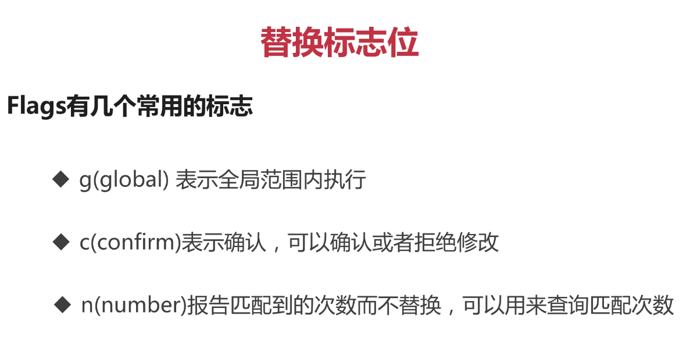

---

## vim多文件操作

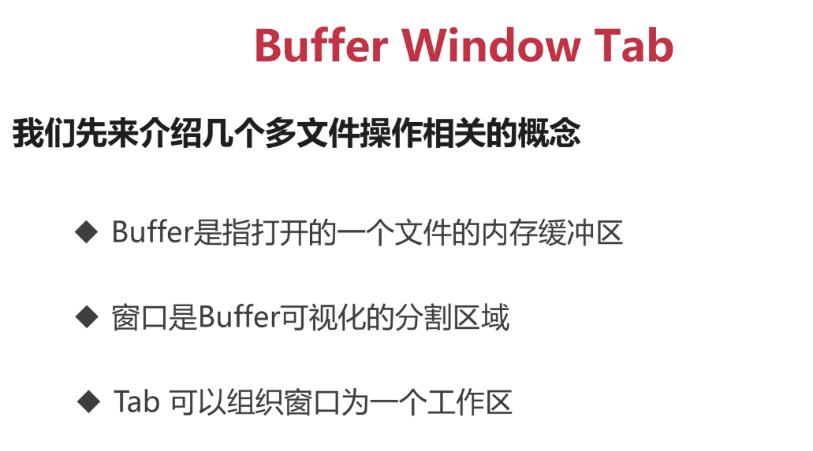

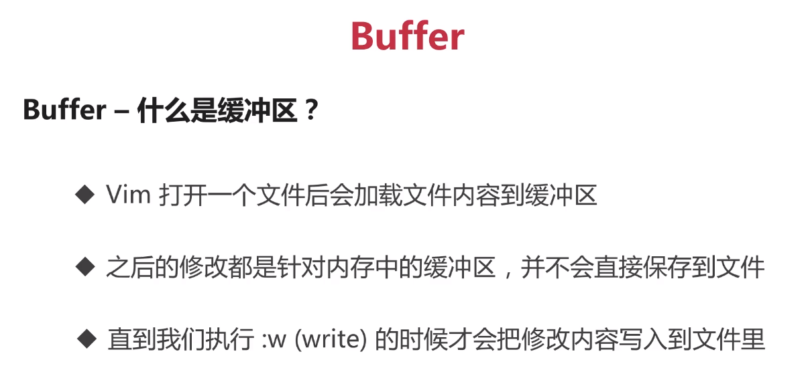


---
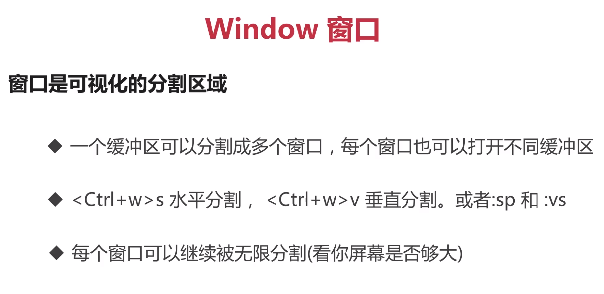
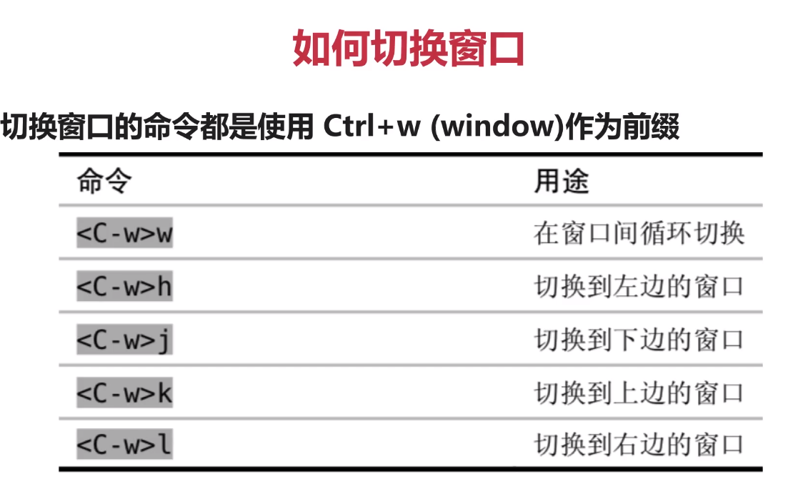
`<C-w-p>`跳转到上一个窗口
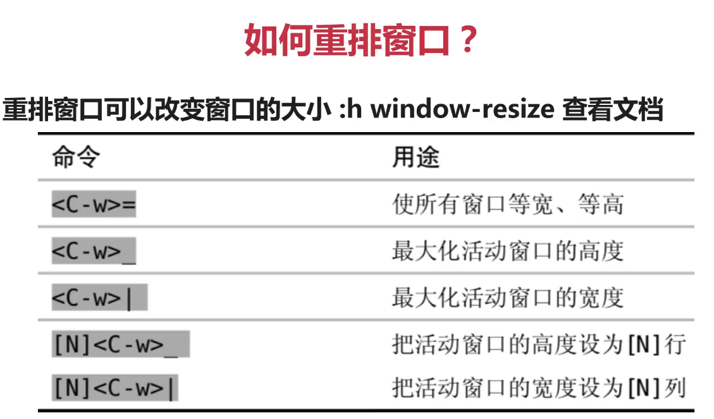

---
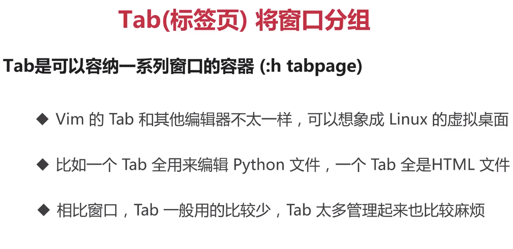

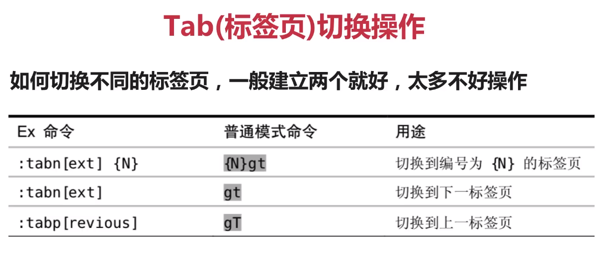

---

## vim的Text Object

```shell
[number]<command>[text object]
```

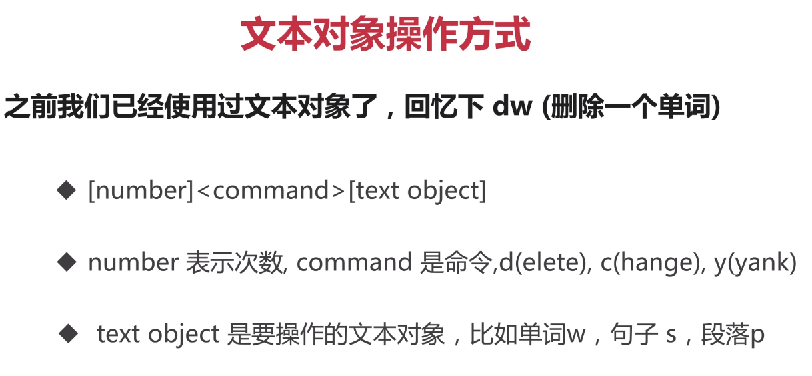

```shell
iw              # inner word
aw              # around word
i"              # inner ""
```

---

## vim下的复制粘贴和寄存器

**normal mode:**

```shell
y               # yank
d               # delete
p               # put
yiw             # yank inner a word
```

**register:**

**其他寄存器**
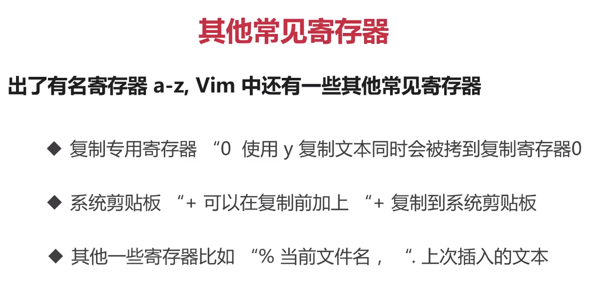

```vim
:e! 重新加载文件 ,且不保存
set clipboard=unnamed       # 使系统剪贴板与无名寄存器共用
set autoindent              # 自动缩进
set paste
set unpaste
```

---

## 宏的录制和使用

Vim使用q键来录制，q键结束录制
使用 q{register} 选择要保存的寄存器，把录制的命令保存其中
使用 @{register} 回放寄存器中的保存的所有命令

---

## 代码补全


---

## 修改vim配色

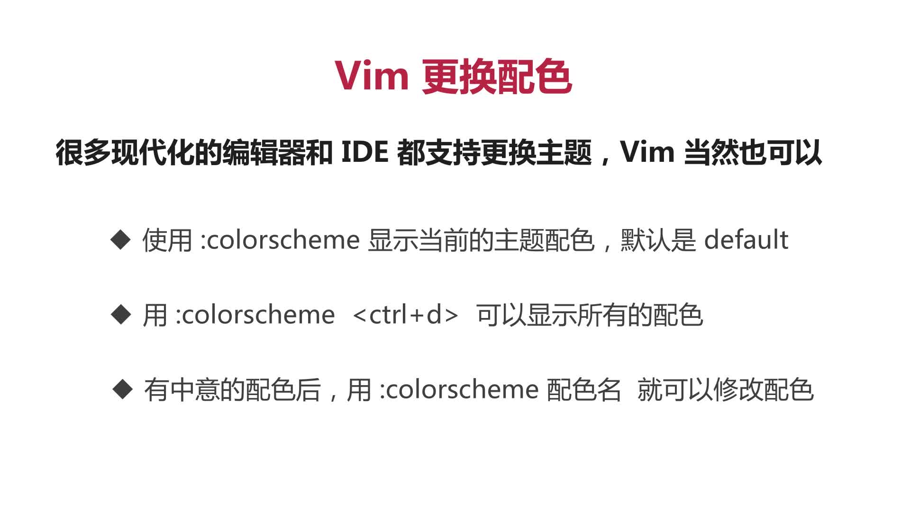

---

## vim常用命令

```vim
:h option-list 命令查询
```

---

## vim映射

vim映射就是把 一个操作 映射到 另一个操作

### 基本映射

所有模式下都生效

```vim
map key default_key         # 在所有模式下生效
unmap key                   # 取消映射

imap key default_key        # 只在insert下生效
imap/nmap/vmap              # 定义的映射只在insert/normal/visual下有效
```

#### 非递归映射

映射不会递归解释映射的按键

```shell
let mapleader = ","         # set Leader Key
nnoremap                    # normal Non-recursive map
inoremap                    # insert
vnoremap                    # visual
```

---

## Plugins

### NERDtree

install vim plug and add this in ~/.vimrc

```shell
Plug 'scrooloose/nerdtree'
# 映射的快捷键
nnoremap <leader>f :NERDTreeFind<cr>        # 快速将光标回到NERDtree的位置
nnoremap <leader>t :NERDTreeToggle<cr>      # toggle NERDtree
let NERDTreeShowHidden=1                    # 显示隐藏文件
let NERDTreeIgnore=['\.swp', '\.pyc']       # NERDTree中不显示的文件
```

NERDtree基本操作

```vim
?: 快速帮助文档
o: 打开一个目录或者打开文件，创建的是buffer，也可以用来打开书签
go: 打开一个文件，但是光标仍然留在NERDTree，创建的是buffer
t: 打开一个文件，创建的是Tab，对书签同样生效
T: 打开一个文件，但是光标仍然留在NERDTree，创建的是Tab，对书签同样生效
i: 水平分割创建文件的窗口，创建的是buffer
gi: 水平分割创建文件的窗口，但是光标仍然留在NERDTree
s: 垂直分割创建文件的窗口，创建的是buffer
gs: 和gi，go类似
x: 收起当前打开的目录
X: 收起所有打开的目录
e: 以文件管理的方式打开选中的目录
D: 删除书签
P: 大写，跳转到当前根路径
p: 小写，跳转到光标所在的上一级路径
K: 跳转到第一个子路径
J: 跳转到最后一个子路径
<C-j>和<C-k>: 在同级目录和文件间移动，忽略子目录和子文件
C: 将根路径设置为光标所在的目录
u: 设置上级目录为根路径
U: 设置上级目录为跟路径，但是维持原来目录打开的状态
r: 刷新光标所在的目录
R: 刷新当前根路径
I: 显示或者不显示隐藏文件
f: 打开和关闭文件过滤器
q: 关闭NERDTree
A: 全屏显示NERDTree，或者关闭全屏
```

---

### ctrlp

模糊搜索当前目录下的文件

---

### vim-easymotion

vim-easymotion
快速移动光标位置

**~/.vimrc**中加入如下递归映射

```shell
nmap <Leader>s <Plug>(easymotion-s2)
```

\<Leader>s 后，输入要查找的两个字符，然后选择文本中出现的高亮字符来跳转到相应的位置

---

### vim-surround

normal mode 下的增加、删除、修改成对的内容
`ds` delete a surrounding
`cs` change a surrounding
`ys` you add a surrounding
**usage:**
`ds"`
`ds(`
`cs"(`
`cs[(`      change surrounding '[' to '('
`ysiw"`
`ystg]`     you add a surrounding to 'char' ']'

also can use in vscode

### commentary.vim

install:
Plug 'tpope/vim-commentary'

usage:
`gcc`    comment/uncomment

### vim-gitgutter

Plug 'airblade/vim-gitgutter'
add `set updatetime=100` in ~/.vimrc

## Tumx

**install Tmux:**

```shell
sudo apt-get install tmux
```

## uppercase or lowercase

```shell
gu{motion}  lowercase
gU{motion}  uppercase
```

## vim 的配置

### 多会话撤销历史

```shell
# 启用 undofile，开启撤销文件
set undofile
# 指定撤销文件位置
set undodir=~/.vim/undodir
```

当 `undodir` 不存在时，创建该目录。

```shell
if !isdirectory(&undodir)
    call mkdir(&undodir, 'p', 0700)
endif
```
